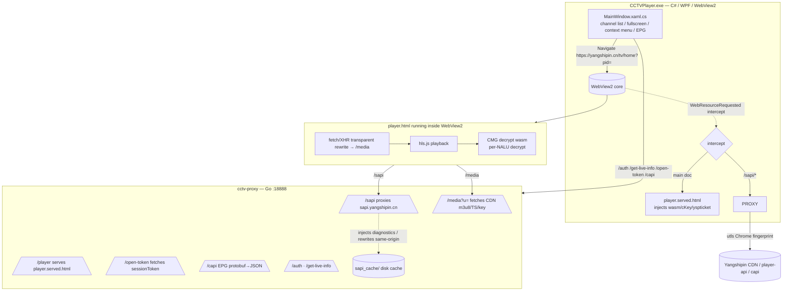

# CCTV / Yangshipin Desktop Player (CCTVPlayer)

> A CCTV / Yangshipin (yangshipin.cn) live-TV desktop client built on **C# / WPF / WebView2 + a Go reverse proxy**.
> Goal: clean, long-running, uninterrupted playback of Yangshipin live streams inside our own app — no official website tab, no black screen, no artifacts, no periodic reload.
>
> The project closes the full loop of "request-parameter cracking → network-layer bypass → video decryption → long-session decay self-healing", and serves as a complete reverse-engineering case study.

⚠️ **Compliance notice**: This project is for **technical research / learning reverse-engineering principles** only. Users must comply with the laws of their jurisdiction and Yangshipin's terms of service. It must not be used for copyright infringement, commercial resale, or bypassing any paywall. The repository contains no copyrighted media content — only interface and algorithm logic derived by the authors through reverse engineering.

> Companion doc: the full reverse-engineering log is in [`whitepaper.en.md`](./whitepaper.en.md) (English); Chinese version: [`央视频定制APP技术白皮书.md`](./央视频定制APP技术白皮书.md) (strongly recommended reading first — it records every dead end and wrong turn so you don't repeat them).

---

## 1. Features

| Category | Status | Notes |
|----------|--------|-------|
| CCTV / satellite live | ✅ | 40+ channels built in (CCTV-1~17, 4K, major satellites) |
| Clean playback | ✅ | VMPATCH3 wasm memory hot-patch: 0 decay frames at 30s, 0 black screens |
| EPG program guide | ✅ | Status-bar scroller ("now / next") + right-click full program list |
| hls.js fatal-error self-heal | ✅ | Decoder crash auto-reloads and resumes streaming |
| Timeshift / in-live seek | ❌ not done | see "8. Unfinished Tasks" |
| Catch-up / VOD playback | ❌ not done (RE'd and reverted) | see "8.2 Catch-up: Failure Postmortem" |
| Local recording | ❌ not done | — |
| Multi-definition | ⚠️ partial | Fixed to `fhd`; `4k`/`8k` supported by the API (see known issues) |

---

## 2. Architecture



**Key idea**: C# uses `WebResourceRequested` to replace the `yangshipin.cn` main document with a local HTML and to redirect `/sapi` to the local Go proxy. This makes the page's **real `location.href = https://yangshipin.cn`** (the seed source for the CMG decryption key), while all media requests go through the Go proxy to dodge CORS / CDN TLS fingerprinting.

---

## 3. Directory Layout

```
d:/TV/CCTV/
├─ cctv-proxy/                # Go reverse proxy + injection
│  ├─ main.go                 # proxy routes + hls.cmg.js/cmg.worker.js injection
│  ├─ build.ps1               # verify inject syntax → go build → overwrite bin
│  ├─ verify_inject.cjs       # inject-string JS syntax checker
│  └─ sapi_cache/             # upstream script disk cache (shipped with release)
├─ CCTVPlayer/                # C# WPF client
│  ├─ MainWindow.xaml(.cs)    # main window / navigation / intercept / EPG scroller
│  ├─ CctvApi.cs              # CctvApiClient: signing algos + channel table + kvcollect
│  ├─ WasmSigner.cs           # fallback: Wasmtime loads keygen_bg.wasm for sig2
│  ├─ player.html             # playback page (network intercept + cKey/yspticket inject)
│  ├─ keygen_bg.wasm          # signing wasm (get_signature / get_token_rnd)
│  ├─ RJq7sO71JF.wasm         # yspticket wasm (AES-CTR + PCG)
│  ├─ ts_module_body.js       # cKey generation core (official chunk-vendors module)
│  └─ CCTVPlayer.csproj       # self-contained single-file publish (win-x64)
├─ 央视频官方源文件/           # original captured scripts (hls.cmg.js etc., reference)
├─ cmg.wat / cmg_decrypt.wasm # decrypted wasm disassembly (reverse-engineering)
└─ 央视频定制APP技术白皮书.md  # full reverse-engineering log (read first)
```

---

## 4. Parameters & Algorithm Generation (Core Principles)

Playing one live stream requires a chain of **signed requests** and **dynamic keys**. All algorithms are reverse-engineered and implemented, in three families:

### 4.1 Request chain
```
/auth ──authToken──┐
                   ├─► /web/open/token ──sessionToken──┐
/get_live_info ────┴──────── sig2(uses sessionToken) ──┴─► m3u8 URL
```
- `authToken` (`/auth`): only the gateway-level `yspplayertoken` header.
- `sessionToken` (`/web/open/token`): the real key for computing `sig2`. **They are not interchangeable — mixing them yields 20401.**

### 4.2 Signature algorithms

| Signature | Algorithm | Sort | Salt | Location |
|-----------|-----------|------|------|----------|
| `auth` body | salted MD5 | Ordinal | `n@7QKk%YeSjfw%22` | `CctvApi.ComputeAuthSignature` |
| `live` body | salted MD5 | Ordinal | `0f$IVHi9Qno?G` | `ComputeLiveBodySignature` |
| `yspsdkinput`(rnd) | unsalted MD5 | **localeCompare** | none | `ComputeLiveSdkInput` |
| `sig2`(yspsdksign) | `keygen_bg.wasm` `get_signature` | — | — | `player.html` `__generateSignature` / `WasmSigner` |
| `kvcollect` heartbeat | salted MD5 | Ordinal | `n@7QKk%YeSjfw%22` | `ComputeKvCollectSignature` |

> ⚠️ **Sort trap**: `su`/`au` (body) use JS default `Array.sort()` (Ordinal); `xs`/`ne` (`yspsdkinput`) use `String.localeCompare`. Mixing → wrong signature → 401.

### 4.3 Dynamic keys (all generated inside WebView2, zero official-site dependency)
- **`cKey`** (324 chars): pure JS (`ts_module_body.js`, replicating official webpack module `fb15`'s `ts()`), using env-stubs for `document.URL` etc. `tsSec` must be a **fresh per-second timestamp** or it expires (401).
- **`yspticket`** (62 bytes): replicating official `_c(livepid, ts, cnlid, guid, yspappid, appVer)` + `RJq7sO71JF.wasm` (AES-CTR + PCG suffix). `ts` comes from the `/auth` response `data.ts`.
- **`sessionToken`**: first `get_token_rnd()` for rnd, then `GET /web/open/token` (with `vappid=59306155`/`vsecret=…`).

### 4.4 Video decryption (CMG wasm, per-NALU)
- Decrypt call site: `hls.cmg.js`'s `fG[wz(0x6bf)](module, ts, nalu, key)`, decrypts only IDR(5)/P/B(1).
- **Root cause**: wasm's `InitPlayer` uses **`self.location.href` (C++ bound, not JS-overridable)** as the key seed; if `location=127.0.0.1` → wrong seed → all frames identity → artifacts.
- **Fix**: C# really navigates `https://yangshipin.cn/tv/home?pid=...` + `WebResourceRequested` intercept (see architecture).
- **Long-session decay (30s artifacts)**: wasm is a VMProtect-style bytecode VM; an internal NALU counter hits ~750 frames then selectively returns identity. **Ultimate fix VMPATCH3**: after InitPlayer (T+6s) snapshot non-zero wasm memory blocks, every 2s diff and write back all changed bytes — counter never reaches threshold → clean uninterrupted playback.
- ⚠️ **Decrypt path status**: the current `cmg.wasm` **only exports the Live path** (`_CMG_jsdecLive0..8`), **no VOD / catch-up decrypt path**. This means that even if a catch-up URL is eventually obtained, the "where does the catch-up decrypt entry come from" problem still has to be solved first (see 8.2).

---

## 5. EPG Program Guide

- Source: `GET https://capi.yangshipin.cn/api/yspepg/program/{pid}/{yyyyMMdd}`, returns **protobuf** (`[1]total [2]programs`, program `[1]id [2]title [5]start [6]end [7]duration`).
- Go proxy `/capi/*` decodes protobuf into a JSON array `[{id,title,start,end},...]`.
- C# refreshes every 30s; status bar shows "now / next" scrolling; right-click "节目单 ▸" submenu lists the full day (current program bold red).

---

## 6. Build & Run

### Dependencies
- **.NET 10 SDK** (target `net10.0-windows`, self-contained single-file)
- **Go 1.2x** (only when changing the proxy)
- **Node.js** (only when `build.ps1` verifies the inject string)
- **WebView2 Runtime** (must be installed on user machines)

### Dev build
```powershell
# after editing cctv-proxy/main.go inject string (mandatory):
cd d:/TV/CCTV/cctv-proxy; .\build.ps1
# after editing C#:
cd d:/TV/CCTV/CCTVPlayer; dotnet build -c Debug
```
> `build.ps1` runs `verify_inject.cjs` (`vm.Script` full-file syntax check) before `go build`. **Never run bare `go build`** — an inject-string syntax error breaks the whole `hls.cmg.js` parse and shows up as "Hls not supported".

### Release package
```powershell
cd d:/TV/CCTV/CCTVPlayer; dotnet publish -c Release
```
**Must ship alongside**:
- `cctv-proxy.exe` (copied automatically by csproj)
- `sapi_cache/` (configured with `CopyToPublishDirectory`)
- `player.html` / `keygen_bg.wasm` / `RJq7sO71JF.wasm` / `ts_module_body.js` (configured)
- `seqid.state` is optional (auto-created on first run)

> 📌 **Known release pitfall**: the single-file release extracts the exe to a temp dir, while `cctv-proxy.exe` looks for `sapi_cache` under `AppContext.BaseDirectory`. Make sure `sapi_cache/` sits next to `cctv-proxy.exe` in the publish dir; EPG needs the Go proxy `/capi` running, otherwise the program list is empty.

---

## 7. Diagnostics & Troubleshooting

| Symptom | Root cause | Fix |
|---------|-----------|-----|
| `401` | algo wrong / timestamp expired | cKey/yspticket/token must be generated live |
| `20401` | `sig2` used authToken | use sessionToken instead |
| `networkError` | CORS / TLS fingerprint | route all media through `/media` |
| all-frame artifacts | `location.href` seed wrong | real-navigate yangshipin.cn + intercept |
| mosaic after 30s | wasm NALU counter hard limit | VMPATCH3 (solved) |
| `[JS] Hls not supported` | inject string JS syntax error | `node --check` / `build.ps1` |

Logs (`bin/.../win-x64/`): `cctv-debug.log` (WebView2 postMessage), `cctv-proxy.log` (Go stdout).

---

## 8. Unfinished Tasks (help wanted 🚀)

### 8.1 Timeshift / in-live seek
- **Goal**: pause and scrub backward during live, or jump to a program's start within the HLS sliding window (DVR-like).
- **Status**: live only, no seek UI yet. Feasible in principle since HLS live has a sliding window, but the interaction layer is missing.
- **Idea**: expose `seekToProgram(offsetSec)` in `player.html` → `v.currentTime = hls.liveSyncPosition - offsetSec`, reusing EPG start/end times. Note CMG decryption is stateful, so seeking beyond the wasm key window may require re-InitPlayer.

### 8.2 ★ Catch-up / VOD playback — reverse-engineered and REVERTED

> **This is the project's hardest unsolved problem and the only attempt explicitly marked "reverse-engineering failed and reverted". Documented as a postmortem so later contributors don't repeat the dead end.**

#### Failure postmortem (Why it failed / dead end)

| Item | Detail |
|------|--------|
| When | 2026-07 (the experimental PR was reverted; the repo contains no catch-up code) |
| Root cause | This project reverse-engineers the **web version** (`yangshipin.cn`), which **has no "catch-up" feature at all** — catch-up (past-program VOD) exists only in the **mobile App**. |
| Attempted route | Pivot to mobile: use **multiple Android emulators** to intercept the App's network requests and capture the official catch-up request. |
| Failure point | Inside the emulators the **TLS handshake never succeeded** — an encrypted connection to Yangshipin's servers could not be established, so **no official catch-up request was ever captured**, and the catch-up playurl API + signing params could not be reverse-engineered. |
| Outcome | Because the prerequisite "obtain a catch-up request" could not be broken, the whole catch-up chain could not proceed. All experimental code was **reverted**; the repo currently has no catch-up-related code. |

#### Why this is harder than live
1. **API not in web version**: the live parameter system (authToken/sessionToken/sig2/cKey/yspticket) all comes from the web version, while the catch-up API lives in the mobile private API and likely uses a different parameter system (different salt, different signing, possibly device fingerprint / token).
2. **No decrypt entry**: as in 4.4, the current `cmg.wasm` only exports the Live decrypt path — **no VOD decrypt export**. Even with a catch-up m3u8, the video may not decrypt with the existing wasm — a mobile-specific VOD decrypt wasm may be required.
3. **TLS / cert pinning**: mobile Apps commonly use certificate pinning; even when capture is possible in an emulator, TLS validation blocks it — exactly the direct technical cause of this failure.

#### Possible future directions (claim only after solving the prerequisite)
1. **Real-device capture**: rooted / jailbroken device + Charles/Fiddler + cert-pinning bypass (e.g. Frida hook `checkServerTrusted`) to grab real catch-up requests.
2. **Hidden web entry**: some programs may carry a `vid` in `capi`; probe for a web-usable VOD endpoint.
3. **VOD decrypt wasm**: if catch-up video needs separate decryption, extract the corresponding VOD decrypt wasm from mobile and replicate the injection chain.
4. **Ship 8.1 first**: as a过渡, implement in-live-window scrubbing so at least "what just aired" is replayable.

### 8.3 Local recording
- Record TS / decrypted frames to mp4 while playing (needs local muxing of CMG-decrypted data).

### 8.4 Multi-definition / 8K stability
- `defn` supports `fhd/shd/4k/8k`. **Known risk**: under 8K high bitrate, VMPATCH3's "skip blocks with diff>2KB" guard may wrongly skip wasm-worker-active blocks → races the worker → buffer error. Needs better 8K memory hot-patch strategy.

### 8.5 Channel-table automation
- `CctvApi.Channels` is hardcoded pid/cnlId. Satellite pids may change when official adds channels. Add: auto-fetch channel list from official API + pid/cnlId validation/self-heal.

### 8.6 Cross-platform
- Currently `win-x64` only (WebView2 is Windows-only). Linux/macOS need CEF / WebKit2 / a custom browser core.

### 8.7 Engineering enhancements (easy, high-value)
- 🔧 **Signature unit tests**: HAR golden values exist; add CI to prevent salt/sort regressions.
- 🔧 **Settings panel**: proxy port, default definition, buffer length, EPG refresh interval, kvcollect toggle.
- 🔧 **Proxy watchdog**: auto-restart `cctv-proxy` on crash.
- 🔧 **`sapi_cache` auto-invalidation**: when upstream CMG script updates, currently a manual cache delete + re-fetch; add version-header comparison.
- 🔧 **Multi-day / future EPG**: currently today only; extend `yyyyMMdd` to fetch coming days.
- 🔧 **Subtitles / multiple audio tracks**: present on some channels, not wired up.
- 🔧 **Playback progress / volume persistence**.
- 🔧 **Channel icons / theme switching**.
- 🔧 **Recording + scheduled recording**: pair with EPG times for timed capture.

---

## 9. How to Contribute

1. Read `央视频定制APP技术白皮书.md` first (full RE log + dead ends).
2. Set up the environment per "6. Build & Run".
3. Debug via `cctv-debug.log` + `cctv-proxy.log`, cross-referencing "7. Diagnostics".
4. Before opening a PR:
   - any `main.go` inject-string change must pass `build.ps1`;
   - test signature changes against HAR golden values;
   - state in the PR which signature / which "battle" logic you touched.
5. When claiming an item in "8. Unfinished Tasks", **for catch-up (8.2) read the postmortem first and sync your idea in an Issue** to avoid repeating the TLS-capture dead end.

---

## 10. Acknowledgements & References
- wasm disassembly via `wabt` (`wat2wasm`/`wasm2wat`).
- Signature validation against real-browser HAR captures (golden values).
- Thanks to the open-source reverse-engineering toolchain community.
