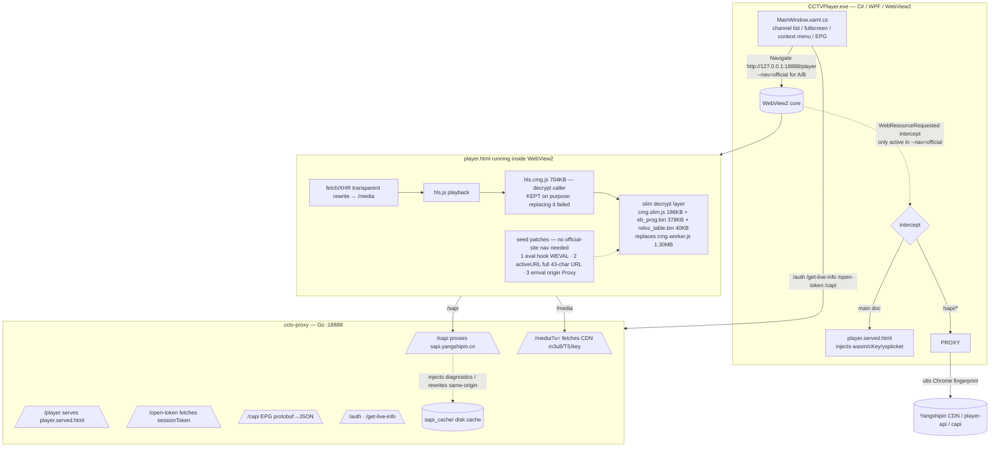

# CCTV / Yangshipin Desktop Player (CCTVPlayer)

> **CCTV / Yangshipin (yangshipin.cn) live-TV clients** — **desktop** (C# / WPF / WebView2 + a Go reverse proxy) **and HarmonyOS** (ArkTS / ArkWeb, `CctvPoC/`).
> Goal: clean, long-running, uninterrupted playback of Yangshipin live streams inside our own app — **no official-website navigation**, no black screen, no artifacts, no periodic reload.
>
> The project closes the full loop of "request-parameter cracking → network-layer bypass → video decryption → long-session decay self-healing → source slimming → HarmonyOS port", and serves as a complete reverse-engineering case study.

⚠️ **Compliance notice**: This project is for **technical research / learning reverse-engineering principles** only. Users must comply with the laws of their jurisdiction and Yangshipin's terms of service. It must not be used for copyright infringement, commercial resale, or bypassing any paywall. The repository contains no copyrighted media content — only interface and algorithm logic derived by the authors through reverse engineering.

> 📌 **Read first**: the complete reverse-engineering log is [`央视频定制APP技术白皮书.md`](./央视频定制APP技术白皮书.md) (**V6.0**, Chinese — strongly recommended; it records every dead end and wrong turn).
>
> ⚠️ **V6.0 is an "overturning" revision (2026-09)**: several conclusions this README previously stated as fact have been **disproven** — most importantly, **you do NOT need to navigate to the official website**. The whitepaper's "§0 Overturned conclusions" table lists all of them; this README has been updated to match.

📦 **Assets & build note**: this public repository contains **self-written code only**. Official web resources, the decryption-engine assets and RE tooling (`源文件/`, `cctv-proxy/sapi_cache/`, `rev/`, and several wasm/js injection assets) are **not distributed in this repo** (kept in a private backup). `CCTVPlayer.csproj` references them conditionally (`Exists`), so a fresh clone without them still compiles; **GitHub Release attachments are complete runnable builds** — download those to run.

---

## 1. Features

| Category | Status | Notes |
|----------|--------|-------|
| CCTV / satellite live | ✅ | 40+ channels built in (CCTV-1~17, 4K, major satellites) |
| Clean playback | ✅ | VMPATCH3 wasm memory hot-patch: 0 decay frames at 30s, 0 black screens |
| **No official-website navigation** | ✅ | Local `127.0.0.1` + `eval` hook (WEVAL) + `activeURL` seed + emval `origin` Proxy. **Overturns the old "must really navigate to yangshipin.cn" conclusion** |
| **Source slimming (slim)** | ✅ | `cmg.worker.js` 1.30MB → `cmg.slim.js` 186KB + `eb_prog.bin` 378KB + `reloc_table.bin` 40KB ≈ **604KB** (−54%). `hls.cmg.js` (704KB) **deliberately kept** — replacing it failed, see 4.4 |
| **HarmonyOS port (`CctvPoC/`)** | ✅ shipped | ArkWeb + slim; channel switching verified on device. **Media-card logo solved (device-verified 2026-09-03)**: only a manual `createAVSession` + `setAVMetadata(mediaImage: PixelMap)` works; audio stays share/MIX — coexists with Kugou music, no exclusivity |
| EPG program guide | ✅ | Status-bar scroller ("now / next") + right-click full program list |
| hls.js fatal-error self-heal | ✅ | Decoder crash auto-reloads and resumes streaming |
| Timeshift / in-live seek | ❌ not done | **decryption is NOT the blocker** — simply never implemented (see 8.1) |
| Catch-up / VOD playback | ❌ not done (RE'd and reverted) | **the VOD decrypt path does exist** (`_CMG_jsdecVOD0..8`) — the only blocker is obtaining the mobile catch-up API (see 8.2) |
| Local recording | ❌ not done | — |
| Multi-definition | ⚠️ partial | Fixed to `fhd`; `4k`/`8k` supported by the API (see known issues) |

---

## 2. Architecture


```mermaid
flowchart TB
    subgraph CSharp[CCTVPlayer.exe — C# / WPF / WebView2]
        UI[MainWindow.xaml.cs<br/>channel list / fullscreen / context menu / EPG]
        WV[(WebView2 core)]
        UI -->|Navigate http://127.0.0.1:18888/player<br/>--nav=official for A/B| WV
        WV -. WebResourceRequested intercept<br/>only active in --nav=official .-> INT{intercept}
        INT -->|main doc| LOCAL[player.served.html<br/>injects wasm/cKey/yspticket]
        INT -->|/sapi/*| PROXY
    end

    subgraph Go[cctv-proxy — Go :18888]
        P1[/ /sapi proxies sapi.yangshipin.cn\]
        P2[/ /media?u= fetches CDN m3u8/TS/key\]
        P3[/ /player serves player.served.html\]
        P4[/ /open-token fetches sessionToken\]
        P5[/ /capi EPG protobuf→JSON\]
        P6[/ /auth · /get-live-info\]
        CACHE[(sapi_cache/ disk cache)]
        P1 -. injects diagnostics / rewrites same-origin .-> CACHE
    end

    subgraph Web[player.html running inside WebView2]
        NET[fetch/XHR transparent rewrite → /media]
        HLS[hls.js playback]
        CMG[hls.cmg.js 704KB — decrypt caller<br/>KEPT on purpose: replacing it failed]
        SLIM[slim decrypt layer<br/>cmg.slim.js 186KB + eb_prog.bin 378KB + reloc_table.bin 40KB<br/>replaces cmg.worker.js 1.30MB]
        SEED[seed patches — no official-site nav needed<br/>1 eval hook WEVAL · 2 activeURL full 43-char URL · 3 emval origin Proxy]
        NET --> HLS --> CMG --> SLIM
        SEED -.-> SLIM
    end

    WV --> Web
    PROXY -->|utls Chrome fingerprint| CDN[(Yangshipin CDN / player-api / capi)]
    Web -->|/media| P2
    Web -->|/sapi| P1
    UI -->|/auth /get-live-info /open-token /capi| Go
```

**Key idea (updated 2026-09)**: the page runs on **local `127.0.0.1:18888/player`**. The CMG decryption seed no longer comes from the real `location` — it is supplied by three patches:

1. **`eval` hook (WEVAL)** — the *only* way wasm reads `location` is `eval()` (`_emscripten_asm_const_ii`, exactly one call site in the whole module), and `eval` is a plain global function you can hook.
2. **`self.activeURL` preset** — the value that actually reaches wasm; `moduleDecData` appends its charCodes after each NALU (length passed separately as `jL`). Must be the **full 43-char URL including the domain**, and the property must be `writable:true`.
3. **emval `origin` Proxy** — the official INITPLAYER branch reads **`self.origin` first**, via `__emval_get_global('origin') → globalThis.origin`. It does **not** go through `eval`, so a naive `/location/` hook misses it. Symptom when missing: **only P/B frames (t=1) break, IDR (t=5) is fine**.

`WebResourceRequested` + real navigation to `yangshipin.cn` is kept only as an A/B and fallback path (`--nav=official`) — it is **no longer required**. Media still flows through the Go proxy to dodge CORS / CDN TLS fingerprinting.

**Proven equivalent**: after the three patches, local playback matches official-site navigation **frame for frame** (first 1200 frames: `same=Y` = **1** in both; and 6013 `same=N` / 9 `same=Y` over 6022 frames vs 1206/1194 before the fix).

---

## 3. Directory Layout

```
d:/TV/CCTV/
├─ cctv-proxy/                # Go reverse proxy + injection
│  ├─ main.go                 # proxy routes + hls.cmg.js injection
│  ├─ build.ps1               # verify inject syntax → go build → overwrite bin
│  ├─ verify_inject.cjs       # inject-string JS syntax checker
│  └─ sapi_cache/             # upstream script disk cache (shipped with release)
│                             #   also holds the slim set served to the page:
│                             #   cmg.slim.js + eb_prog.bin + reloc_table.bin (replaces cmg.worker.js 1.30MB)
├─ CCTVPlayer/                # C# WPF client
│  ├─ MainWindow.xaml(.cs)    # main window / local navigation / intercept (A/B) / EPG scroller
│  ├─ CctvApi.cs              # CctvApiClient: signing algos + channel table + kvcollect
│  ├─ WasmSigner.cs           # fallback: Wasmtime loads keygen_bg.wasm for sig2
│  ├─ player.html             # playback page: net intercept + cKey/yspticket inject + the 3 seed patches
│  ├─ keygen_bg.wasm          # signing wasm (get_signature / get_token_rnd)
│  ├─ RJq7sO71JF.wasm         # yspticket wasm (AES-CTR + PCG)
│  ├─ ts_module_body.js       # cKey generation core (official chunk-vendors module)
│  └─ CCTVPlayer.csproj       # self-contained single-file publish (win-x64)
├─ CctvPoC/                   # ★ HarmonyOS client (ArkTS / ArkWeb)
│  ├─ entry/src/main/ets/pages/Index.ets      # ← bump PLAYER_DEPLOY_VER when player.html changes
│  ├─ entry/src/main/ets/.../ArktsProxy.ets   # pure-ArkTS local proxy :18888 (no native child process)
│  └─ entry/src/main/resources/rawfile/web/player.html
├─ rev/                       # ★ offline reverse-engineering lab (Node)
│  ├─ gen_slim.cjs            # builds cmg.slim.js (eval/emval patches + eb_prog externalisation)
│  ├─ gen_hm_inline.cjs       # inlines slim + assets into the HarmonyOS player.html
│  └─ dist/                   # cmg.slim.js · eb_prog.bin · reloc_table.bin · cmgdec.js
├─ 央视频官方源文件/           # original captured scripts (hls.cmg.js etc., reference)
├─ cmg.wat / cmg_decrypt.wasm # decrypted wasm disassembly (reverse-engineering)
├─ cmg_c.c / wasm-rt.h        # ★ wasm2c port — native decrypt core (Plan B, see §9.4)
└─ 央视频定制APP技术白皮书.md  # full reverse-engineering log (read first)
```

---

## 4. Parameters & Algorithm Generation (Core Principles)

Playing one live stream requires a chain of **signed requests** and **dynamic keys**. All algorithms are reverse-engineered and implemented, in three families:

### 4.1 Request chain
```
/auth ──authToken──┐
                   ├─► /web/open/token ──sessionToken──┐
/get_live_info ────┴──────── sig2(uses sessionToken) ──┴─► m3u8 URL
```
- `authToken` (`/auth`): only the gateway-level `yspplayertoken` header.
- `sessionToken` (`/web/open/token`): the real key for computing `sig2`. **They are not interchangeable — mixing them yields 20401.**

### 4.2 Signature algorithms

| Signature | Algorithm | Sort | Salt | Location |
|-----------|-----------|------|------|----------|
| `auth` body | salted MD5 | Ordinal | `n@7QKk%YeSjfw%22` | `CctvApi.ComputeAuthSignature` |
| `live` body | salted MD5 | Ordinal | `0f$IVHi9Qno?G` | `ComputeLiveBodySignature` |
| `yspsdkinput`(rnd) | unsalted MD5 | **localeCompare** | none | `ComputeLiveSdkInput` |
| `sig2`(yspsdksign) | `keygen_bg.wasm` `get_signature` | — | — | `player.html` `__generateSignature` / `WasmSigner` |
| `kvcollect` heartbeat | salted MD5 | Ordinal | `n@7QKk%YeSjfw%22` | `ComputeKvCollectSignature` |

> ⚠️ **Sort trap**: `su`/`au` (body) use JS default `Array.sort()` (Ordinal); `xs`/`ne` (`yspsdkinput`) use `String.localeCompare`. Mixing → wrong signature → 401.

### 4.3 Dynamic keys (all generated inside WebView2, zero official-site dependency)
- **`cKey`** (324 chars): pure JS (`ts_module_body.js`, replicating official webpack module `fb15`'s `ts()`), using env-stubs for `document.URL` etc. `tsSec` must be a **fresh per-second timestamp** or it expires (401).
- **`yspticket`** (62 bytes): replicating official `_c(livepid, ts, cnlid, guid, yspappid, appVer)` + `RJq7sO71JF.wasm` (AES-CTR + PCG suffix). `ts` comes from the `/auth` response `data.ts`.
- **`sessionToken`**: first `get_token_rnd()` for rnd, then `GET /web/open/token` (with `vappid=59306155`/`vsecret=…`).

### 4.4 Video decryption (CMG wasm, per-NALU)

- **Decrypt call site**: `hls.cmg.js`'s `fG[wz(0x6bf)](module, ts, nalu, key)`; only **IDR(5) / P/B(1)** are decrypted. **It must be per-NALU** — every call is a complete self-contained round trip (URL and key are re-sent each time), so missing a single NALU produces artifacts. SPS/PPS/SEI/AUD are already plaintext, so this is already the minimal set: **no further optimisation available**.
- **Key seed (★ corrected 2026-09)**: the old claim was that wasm uses `self.location.href` (C++ bound, not JS-overridable) as the seed, and therefore the app **had to** really navigate to `yangshipin.cn`. **That is wrong.** The real picture is the three patches in "Key idea" above (`eval` hook + `self.activeURL` + emval `origin` Proxy). **Real navigation is not required.**
- **Long-session decay (30s artifacts)**: wasm is a VMProtect-style bytecode VM (`func[51]` / `func[71]` dispatch via `br_table`); an internal **~750-frame counter** then selectively returns identity. That counter is an **anti-tamper self-check, not a licence**. **Ultimate fix VMPATCH3**: after InitPlayer (T+6s) snapshot the non-zero wasm memory blocks, then every 2s diff and write back all changed bytes — the counter never reaches the threshold → clean uninterrupted playback.
  - ⚠️ The scan range `6684672~6698000` is **hard-coded to this wasm build** (`V=1.2.1`, `CMG_BTime=Aug 13 2025`). Re-verify it whenever upstream ships a new wasm (whitepaper §15.2).
- **Decrypt path status (★ corrected 2026-09)**: the wasm exports **both** Live and VOD paths — `_CMG_jsdecLive0..8` **and `_CMG_jsdecVOD0..8`** (`na..va = func[73..105]`), plus `StaticCallModuleVod` (10 methods) and `StaticCallModuleVodMap = [0..6]`. `moduleDecData`'s 4th argument is already `'live' | 'vod'`.
  - ⇒ **Decryption is NOT the blocker for catch-up / VOD.** The old "no VOD decrypt export" claim came from a mis-read of the export table. See 8.2.
- **Slot map (measured via Proxy)**: function-name index 8 = `MpegAudio` → `_CMG_jsdecLive8` / `_CMG_jsdecVOD8`; 7 = H264NalSet; 6 = H265NalData; 5 = AVS1AudioKey; 4 = HEVC2AAC; 3 = HASHMap; 2 = BASE64Dec; 1 = MediaSession; 0 = Mp4fragment.
- **Call signature (verified)**: `_CMG_jsdecLive8(tagIdPtr, naluPtr, naluLen, urlLen)` — **4 args**, returns the input length and writes **in place**. Memory layout: `[nalu][activeURL charCodes][mediaTagId charCodes]`.
- ⚠️ `jsdecLive8` is a **state-machine transform, not XOR** (calling it a second time on already-decrypted data still changes the output). Therefore **`diff > 0` does not prove you decrypted correctly** — the only valid check is a **byte-for-byte comparison against the official implementation's output**.

---

## 5. EPG Program Guide

- Source: `GET https://capi.yangshipin.cn/api/yspepg/program/{pid}/{yyyyMMdd}`, returns **protobuf** (`[1]total [2]programs`, program `[1]id [2]title [5]start [6]end [7]duration`).
- Go proxy `/capi/*` decodes protobuf into a JSON array `[{id,title,start,end},...]`.
- C# refreshes every 30s; status bar shows "now / next" scrolling; right-click "节目单 ▸" submenu lists the full day (current program bold red).

---

## 6. Build & Run

### Dependencies
- **.NET 10 SDK** (target `net10.0-windows`, self-contained single-file)
- **Go 1.2x** (only when changing the proxy)
- **Node.js** (only when `build.ps1` verifies the inject string)
- **WebView2 Runtime** (must be installed on user machines)

### Dev build
```powershell
# after editing cctv-proxy/main.go inject string (mandatory):
cd d:/TV/CCTV/cctv-proxy; .\build.ps1
# after editing C#:
cd d:/TV/CCTV/CCTVPlayer; dotnet build -c Debug
```
> `build.ps1` runs `verify_inject.cjs` (`vm.Script` full-file syntax check) before `go build`. **Never run bare `go build`** — an inject-string syntax error breaks the whole `hls.cmg.js` parse and shows up as "Hls not supported".

### Release package
```powershell
cd d:/TV/CCTV/CCTVPlayer; dotnet publish -c Release
```
**Must ship alongside**:
- `cctv-proxy.exe` (copied automatically by csproj)
- `sapi_cache/` (configured with `CopyToPublishDirectory`)
- `player.html` / `keygen_bg.wasm` / `RJq7sO71JF.wasm` / `ts_module_body.js` (configured)
- `seqid.state` is optional (auto-created on first run)

> 📌 **Known release pitfall**: the single-file release extracts the exe to a temp dir, while `cctv-proxy.exe` looks for `sapi_cache` under `AppContext.BaseDirectory`. Make sure `sapi_cache/` sits next to `cctv-proxy.exe` in the publish dir; EPG needs the Go proxy `/capi` running, otherwise the program list is empty.

---

## 7. Diagnostics & Troubleshooting

| Symptom | Root cause | Fix |
|---------|-----------|-----|
| `401` | algo wrong / timestamp expired | cKey/yspticket/token must be generated live |
| `20401` | `sig2` used authToken | use sessionToken instead |
| `networkError` | CORS / TLS fingerprint | route all media through `/media` |
| all-frame artifacts | **one of the three seed patches is off**. Most often `activeURL` is the 30-char value *after* `replace('yangshipin.cn','')`, or `defineProperty` is missing `writable:true` — note the resulting `Cannot assign to read only property 'activeURL'` error is **our own bug, not a WebView2 limitation** | preset the **full 43-char URL** with `writable:true`; see 4.4 / whitepaper §10 |
| **only P/B frames (t=1) break, IDR (t=5) is fine** | `self.origin` leaking through emval (`__emval_get_global('origin')`) — it bypasses `eval`, so a `/location/`-only hook misses it | add the emval `origin` Proxy |
| mosaic after 30s | wasm ~750-frame anti-tamper counter | VMPATCH3 (solved). Re-check the scan range after any upstream wasm update |
| `[JS] Hls not supported` | inject string JS syntax error | `node --check` / `build.ps1` |
| HarmonyOS: black screen after channel switch + `memory access out of bounds` | `__SLIM_WRITE_EB__` closure captured the **first** instance's `HEAPU8`/`eb`, so instance #2 writes eb_prog into instance #1's heap | pass the heap in as arguments and drop `__SLIM_DONE__` (whitepaper §11.4) |
| HarmonyOS: media card has **no channel logo** | ★ corrected 2026-09: web-side `navigator.mediaSession.metadata` **never works** — `artwork 已设置` logs fine but ArkWeb **does not bridge** MediaSession artwork to the system AVSession | **only** a native manual `createAVSession` + `setAVMetadata({mediaImage: PixelMap})` works (catch `6600101`; whitepaper §12.3) |
| HarmonyOS: media card **disappears** after calling `createAVSession` | ★ corrected 2026-09: **not** "manual creation conflicts". Real cause = treating **`6600101`** (session already exists, ArkWeb may have created one) as fatal | follow §9.3: catch `6600101` and skip + register listeners before `activate()` + `deactivate()`/`destroy()` on exit |

Logs (`bin/.../win-x64/`): `cctv-debug.log` (WebView2 postMessage), `cctv-proxy.log` (Go stdout).

---

## 8. Unfinished Tasks (help wanted 🚀)

### 8.1 Timeshift / in-live seek
- **Goal**: pause and scrub backward during live, or jump to a program's start within the HLS sliding window (DVR-like).
- **Status**: live only, no seek UI yet. Feasible in principle since HLS live has a sliding window, but the interaction layer is missing.
- **Idea**: expose `seekToProgram(offsetSec)` in `player.html` → `v.currentTime = hls.liveSyncPosition - offsetSec`, reusing EPG start/end times. Note CMG decryption is stateful, so seeking beyond the wasm key window may require re-InitPlayer.
- **Clarification**: `IsCurrent` (current-program highlight in the EPG) **is** implemented; only the seek/replay part is missing. **Decryption is not the blocker here** — this is simply unimplemented UI + plumbing.

### 8.2 ★ Catch-up / VOD playback — reverse-engineered and REVERTED

> **This is the project's hardest unsolved problem and the only attempt explicitly marked "reverse-engineering failed and reverted". Documented as a postmortem so later contributors don't repeat the dead end.**

#### Failure postmortem (Why it failed / dead end)

| Item | Detail |
|------|--------|
| When | 2026-07 (the experimental PR was reverted; the repo contains no catch-up code) |
| Root cause | This project reverse-engineers the **web version** (`yangshipin.cn`), which **has no "catch-up" feature at all** — catch-up (past-program VOD) exists only in the **mobile App**. |
| Attempted route | Pivot to mobile: use **multiple Android emulators** to intercept the App's network requests and capture the official catch-up request. |
| Failure point | Inside the emulators the **TLS handshake never succeeded** — an encrypted connection to Yangshipin's servers could not be established, so **no official catch-up request was ever captured**, and the catch-up playurl API + signing params could not be reverse-engineered. |
| Outcome | Because the prerequisite "obtain a catch-up request" could not be broken, the whole catch-up chain could not proceed. All experimental code was **reverted**; the repo currently has no catch-up-related code. |

#### Why this is harder than live
1. **API not in web version**: the live parameter system (authToken/sessionToken/sig2/cKey/yspticket) all comes from the web version, while the catch-up API lives in the mobile private API and likely uses a different parameter system (different salt, different signing, possibly device fingerprint / token). **This is the only real blocker.**
2. ~~**No decrypt entry**~~ → **★ corrected 2026-09: this was simply wrong.** The wasm exports **`_CMG_jsdecVOD0..8`** (`na..va = func[73..105]`), plus `StaticCallModuleVod` (10 methods) and `StaticCallModuleVodMap = [0..6]`, and `moduleDecData`'s 4th argument is already `'live' | 'vod'`. **Decryption is not the blocker** (see 4.4) — don't go hunting for a separate "VOD decrypt wasm".
3. **TLS / cert pinning**: mobile Apps commonly use certificate pinning; even when capture is possible in an emulator, TLS validation blocks it — exactly the direct technical cause of this failure.

#### Possible future directions (claim only after solving the prerequisite)
1. **Real-device capture**: rooted / jailbroken device + Charles/Fiddler + cert-pinning bypass (e.g. Frida hook `checkServerTrusted`) to grab real catch-up requests. **This is the prerequisite for everything else.**
2. **Hidden web entry**: some programs may carry a `vid` in `capi`; probe for a web-usable VOD endpoint — cheapest to try, **worth doing first**.
3. ~~**VOD decrypt wasm**~~ — **not needed** unless the catch-up stream turns out to use a different scheme; the current wasm already exposes the VOD path. Only revisit if a byte-for-byte comparison against official output fails.
4. **Ship 8.1 first**: as a stopgap, implement in-live-window scrubbing so at least "what just aired" is replayable. Note CMG decryption is **stateful**, so a seek across the wasm key window may require a re-`InitPlayer`.

### 8.3 Local recording
- Record TS / decrypted frames to mp4 while playing (needs local muxing of CMG-decrypted data).

### 8.4 Multi-definition / 8K stability
- `defn` supports `fhd/shd/4k/8k`. **Known risk**: under 8K high bitrate, VMPATCH3's "skip blocks with diff>2KB" guard may wrongly skip wasm-worker-active blocks → races the worker → buffer error. Needs better 8K memory hot-patch strategy.

### 8.5 Channel-table automation
- `CctvApi.Channels` is hardcoded pid/cnlId. Satellite pids may change when official adds channels. Add: auto-fetch channel list from official API + pid/cnlId validation/self-heal.

### 8.6 Cross-platform
- Desktop is `win-x64` only (WebView2 is Windows-only). Linux/macOS need CEF / WebKit2 / a custom browser core.
- **HarmonyOS is already shipped** (`CctvPoC/`, see §9). Good news: Plan A's **engine-agnostic** nature was proven by the ArkWeb port, so a CEF port is comparatively low-risk.

### 8.7 Engineering enhancements (easy, high-value)
- 🔧 **Make VMPATCH3 self-adapting**: the scan range `6684672~6698000` is hard-coded to this wasm build (`V=1.2.1`, `CMG_BTime=Aug 13 2025`). Auto-detect non-zero 4KB blocks and assert on the wasm version, so an upstream update **fails loudly** instead of silently producing artifacts.
- 🔧 **`sapi_cache` auto-invalidation**: when upstream CMG scripts update, today it's a manual delete + re-fetch. Auto-compare the version header / length, re-fetch on change, **and re-run `verify_inject.cjs`** — an un-re-validated inject string breaks the whole `hls.cmg.js` parse and surfaces as the misleading "`[JS] Hls not supported`".
- 🔧 **Signature unit tests**: HAR golden values exist; add CI to prevent salt/sort regressions.
- 🔧 **Settings panel**: proxy port, default definition, buffer length, EPG refresh interval, kvcollect toggle.
- 🔧 **Proxy watchdog**: auto-restart `cctv-proxy` on crash.
- 🔧 **Serve `eb_prog.bin` / `reloc_table.bin` gzipped**: 378KB → 140,645B and 40KB → 4,799B. Keep them as separate files (transport gzip) — **don't** inline the decompressed form, since `ATPRERUN` is synchronous.
- 🔧 **Multi-day / future EPG**: currently today only; extend `yyyyMMdd` to fetch coming days.
- 🔧 **Subtitles / multiple audio tracks**: present on some channels, not wired up.
- 🔧 **Playback progress / volume persistence**.
- 🔧 **Channel icons / theme switching**.
- 🔧 **Recording + scheduled recording**: pair with EPG times for timed capture.

---

## 9. HarmonyOS port (`CctvPoC/`)

The same decrypt chain runs on HarmonyOS inside **ArkWeb** (same engine family as WebView2), so the reverse-engineering work carries over almost unchanged.

### 9.1 What differs from desktop

| Desktop | HarmonyOS | Why |
|---|---|---|
| Go child process (`cctv-proxy.exe`) | **ArktsProxy** — a pure-ArkTS local HTTP server on `127.0.0.1:18888` | phones **cannot spawn native child processes** (error 801) |
| `cmg.worker.js` 1.30MB | **slim**: `cmg.slim.js` 186KB + `eb_prog.bin` 378KB + `reloc_table.bin` 40KB | 85% of the original file was a decimal-array literal; see 4.4 |
| `dotnet build` copies `player.html` | bump **`PLAYER_DEPLOY_VER`** in `entry/src/main/ets/pages/Index.ets` | `player.html` is injected into `player_boot.html` and **cached** — without a version bump your change never takes effect. Log marker: `(首次部署)` = really redeployed, `(缓存命中)` = stale |

### 9.2 ⚠️ `enableNativeMediaPlayer` is incompatible with this project's decrypt architecture

- Our decrypt chain produces plaintext only inside JS, and it can reach the decoder **only via MSE `sourceBuffer.appendBuffer()`** — which means `video.src` is a `blob:`/MediaSource URL with **no real URL**.
- `enableNativeMediaPlayer` hands the `<video>`'s `src`/`mediaInfo` to a native AVPlayer that then fetches the stream itself — **MSE data never goes through `src`**.
- ⇒ after takeover, AVPlayer plays the **original, still-encrypted HLS** → artifacts / green screen. (Same root cause as the failed "standard hls.js + custom cmgdec bridge" attempt: only CCTV-6, which is **unencrypted**, would play.)

**It's an either/or**: decrypt ⇒ MSE ⇒ no takeover ⇒ no native decode performance; takeover ⇒ unencrypted channels only. **At the "web-side decrypt + native decode" seam, the data simply cannot cross.**

### 9.3 ★ Media card logo (AVSession) — final conclusion (verified on device, 2026-09-03)

> ⚠️ This **overturns** the previous guidance ("never call `createAVSession`; use `navigator.mediaSession.metadata`").

**One sentence: the only working way to get the channel logo is a **native manual `createAVSession`** + **`setAVMetadata({ mediaImage: PixelMap })`**.**

- **`navigator.mediaSession.metadata` never worked**: device logs show `artwork 已设置 144x72` (the web side is correct), yet the system media card **never showed a logo** ⇒ **ArkWeb does not bridge MediaSession artwork to the system AVSession** on this device/version. Re-pushing at first frame, fixing `sizes`, per-session flags — all ineffective. **Do not waste more time on the web path.**
- **Manual `createAVSession` fixes the logo perfectly** (verified on device). Working reference: `backup_CctvPoC_20260830_clean/`.

**Implementation checklist (all required):**
1. `avSession.createAVSession(ctx, 'CCTVPlayer', 'video')`;
2. **Must catch `6600101` (session already exists) and skip** — ArkWeb may have created one first; **it is not a fatal error**. ⚠️ The old "media card disappears" reports (3×) were caused by treating `6600101` as fatal — **not** by manual creation itself;
3. register `play`/`pause` listeners **before** `activate()`;
4. initial `setAVPlaybackState(PAUSE)`, flip to `PLAY` when actually playing;
5. logo via `setAVMetadata({ assetId, title, artist, mediaImage: pixelMap, duration: 0 })`, decoding the base64 dataURL through `image.createImageSource`;
6. on exit: `deactivate()` + `destroy()`;
7. run `initAVSession()` **in parallel** with proxy/page startup (cold-start optimisation).

**Real artwork sizes**: CCTV-family **144×72**, satellite **144×100**.

### 9.4 ★ `AVSession` ≠ `AudioSession` (the root of the "audio-exclusive" worry)

| | **AVSession** (AVSessionKit) | **AudioSession** (AudioKit `AudioSessionManager`) |
|---|---|---|
| Role | media session: **presentation** on the control centre / media card (title, logo, play/pause) | audio session: decides the **audio concurrency policy** (whether other apps' sound is interrupted) |
| Participates in audio focus? | **No, not at all** | **Yes** (`MIX_WITH_OTHERS` / `PAUSE_OTHERS`) |
| Effect of manual creation | only "is there a media card / logo" | only "mix or exclusive" |

⇒ **Manual `createAVSession` has ZERO effect on audio exclusivity.** Want the logo → create the AVSession; want audio compliance → set the `AudioSessionManager` concurrency mode. They are independent.

**Audio compliance as currently shipped (both code versions already set `audioExclusive:false`):**
- Current (reverted) code: `AudioSessionManager` **always** `CONCURRENCY_MIX_WITH_OTHERS` (most conservative).
- Logo-working backup (2026-08-30): **dynamic** — muted → `MIX` (does not interrupt others); unmuted → `PAUSE_OTHERS`; releases focus via `deactivateAudioSession()` on exit.
- **AppGallery review risk**: `PAUSE_OTHERS` applies only while sound is actually playing — that is **standard, expected video-player behaviour** (same as YouTube / Yangshipin). The muted→MIX give-away and release-on-exit are good citizenship. **If you want to be maximally conservative**: restore only the AVSession part and keep the AudioSession pinned to `MIX` → logo solved, audio behaviour unchanged, lowest review risk.

### 9.5 Native AVPlayer takeover (Plan B) — current status

- **Decryption is proven viable outside the browser**: the `wasm2c` port (`cmg_c.c`) produces output **byte-for-byte identical to the official Node implementation, 6/6 frames**. The earlier "Plan B is dead" verdict was a **false negative caused by a harness bug** (`emval_as` returned an emval handle for `std::string` instead of the wire pointer, so the domain check failed and `InitPlayer` took its decoy branch).
- **But Plan B as a whole stays frozen** — the remaining blockers are on the **AVPlayer integration** side, not decryption: demux is not instrumentable (you'd have to build TS→PES→NALU→decrypt→re-feed yourself), decrypt output is **not length-preserving** (e.g. `32198 → 32197`) so NALU length fields must be rewritten, and `InitPlayer` is a deeply recursive bytecode VM.
- **Viable skeleton if ever resumed**: HarmonyOS **API 20 (HarmonyOS 6.0)+** offers `OH_AVDataSource`, where your `readAt` callback feeds **already-decrypted** bytes to `AVDemuxer → AVCodec`. That dissolves the "AVPlayer is a black box" problem because *you* own the data source. Remaining work collapses to "TS parse/re-mux + self-managed HLS playlist".
- **On "version drift / fragility"**: both plans are equally exposed — Plan A also needs a fresh slim capture, a re-run of `verify_inject`, and a new store submission. The **only** real difference is the **demux/NALU integration cost** (free in Plan A via hls.js, self-built in Plan B).

---

## 10. How to Contribute

1. Read `央视频定制APP技术白皮书.md` first (full RE log + dead ends).
2. Set up the environment per "6. Build & Run".
3. Debug via `cctv-debug.log` + `cctv-proxy.log`, cross-referencing "7. Diagnostics".
4. Before opening a PR:
   - any `main.go` inject-string change must pass `build.ps1`;
   - test signature changes against HAR golden values;
   - state in the PR which signature / which "battle" logic you touched.
5. When claiming an item in "8. Unfinished Tasks", **for catch-up (8.2) read the postmortem first and sync your idea in an Issue** to avoid repeating the TLS-capture dead end.

---

## 11. Acknowledgements & References
- wasm disassembly via `wabt` (`wat2wasm`/`wasm2wat`).
- Signature validation against real-browser HAR captures (golden values).
- Thanks to the open-source reverse-engineering toolchain community.
