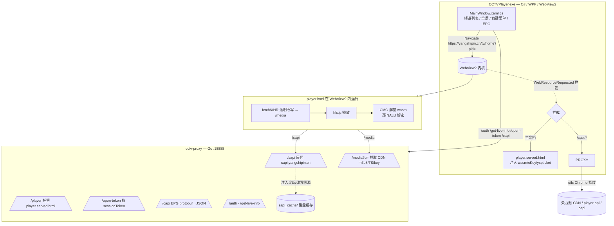

# CCTV / 央视频 桌面播放器（CCTVPlayer）

> 一个基于 **C# / WPF / WebView2 + Go 反向代理** 的央视频（yangshipin.cn）直播桌面客户端。
> 目标：在自有应用中实现央视频直播的**纯净、长期、无间断播放**——不打开官网页面，无黑屏、无花屏、无周期重载。
>
> 项目核心攻克了「请求参数破解 → 网络层绕过 → 视频解密攻破 → 长期播放衰减自愈」的端到端闭环，是一份完整的逆向工程实战样本。

⚠️ **合规声明**：本项目仅供 **技术研究 / 学习逆向工程原理** 使用。使用者须遵守所在地区法律法规与央视频平台服务条款，不得用于任何侵权传播、商业转售或绕过付费墙的行为。仓库代码不包含任何受版权保护的媒体内容，仅含自行逆向得出的接口与算法逻辑。

> 配套文档：完整逆向记录见 [`央视频定制APP技术白皮书（中文）`](./央视频定制APP技术白皮书.md)；英文版见 [`whitepaper.en.md`](./whitepaper.en.md)（强烈建议先读，内含每场“战役”的死路与弯路，可避免重复踩坑）。

---

## 一、功能特性

| 类别 | 状态 | 说明 |
|------|------|------|
| 央视 / 卫视直播 | ✅ | 内置 40+ 频道（CCTV-1~17、4K、各大卫视） |
| 纯净播放 | ✅ | VMPATCH3 wasm 内存热修补，30s 衰减 0 帧、黑屏 0 次 |
| 节目单 EPG | ✅ | 状态栏滚动显示「正在 / 即将」，右键菜单完整节目表 |
| hls.js 致命错误自愈 | ✅ | 解码崩溃自动重载并恢复拉流 |
| 时移 / 直播内拖动 | ❌ 未完成 | 见「八、未完成任务」 |
| 节目回看 / 点播 | ❌ 未完成（逆向失败已还原） | 见「8.2 回看：失败总结」 |
| 本地录制 | ❌ 未完成 | — |
| 多清晰度切换 | ⚠️ 部分 | 当前固定 `fhd`，接口已支持 4K / 8K（见已知问题） |

---

## 二、整体架构



**要点**：C# 通过 `WebResourceRequested` 把 `yangshipin.cn` 主文档替换成本地 HTML、把 `/sapi` 转给本地 Go 代理，从而使页面**真实 `location.href = https://yangshipin.cn`**（CMG 解密密钥种子的来源），同时所有媒体请求经 Go 代理转发以规避 CORS / CDN TLS 指纹。

---

## 三、目录结构

```
d:/TV/CCTV/
├─ cctv-proxy/                # Go 反向代理 + 注入
│  ├─ main.go                 # 代理路由 + hls.cmg.js/cmg.worker.js 注入
│  ├─ build.ps1               # 校验注入语法 → go build → 覆盖 bin
│  ├─ verify_inject.cjs       # 注入串 JS 语法校验
│  └─ sapi_cache/             # 上游脚本磁盘缓存（随发布包分发）
├─ CCTVPlayer/                # C# WPF 客户端
│  ├─ MainWindow.xaml(.cs)    # 主窗口 / 导航 / 拦截 / 滚动 EPG
│  ├─ CctvApi.cs              # CctvApiClient：签名算法 + 频道表 + kvcollect
│  ├─ WasmSigner.cs           # 备用：Wasmtime 加载 keygen_bg.wasm 算 sig2
│  ├─ player.html             # 播放页（网络拦截 + cKey/yspticket 注入）
│  ├─ keygen_bg.wasm          # 签名 wasm（get_signature / get_token_rnd）
│  ├─ RJq7sO71JF.wasm         # yspticket wasm（AES-CTR + PCG）
│  ├─ ts_module_body.js       # cKey 生成内核（官方 chunk-vendors 模块）
│  └─ CCTVPlayer.csproj       # 单文件自包含发布（win-x64）
├─ 央视频官方源文件/           # 抓包原始脚本（hls.cmg.js 等，参考用）
├─ cmg.wat / cmg_decrypt.wasm # 解密 wasm 反编译（逆向分析用）
└─ 央视频定制APP技术白皮书.md  # 完整逆向记录（强烈建议先读）
```

---

## 四、参数与算法生成（核心原理）

播放一次直播需构造一连串**带签名的请求**与**动态密钥**。全部算法已逆向并落地，分为三套体系：

### 4.1 请求链路
```
/auth ──authToken──┐
                   ├─► /web/open/token ──sessionToken──┐
/get_live_info ────┴──────── sig2(用 sessionToken) ───┴─► m3u8 URL
```
- `authToken`（`/auth` 返回）：仅作网关层 `yspplayertoken` 头。
- `sessionToken`（`/web/open/token` 返回）：是计算 `sig2` 的真正密钥。**两者互不相通，混用会 20401**。

### 4.2 签名算法一览

| 签名 | 算法 | 排序 | 盐 | 位置 |
|------|------|------|----|------|
| `auth` body 签名 | 盐化 MD5 | Ordinal | `n@7QKk%YeSjfw%22` | `CctvApi.ComputeAuthSignature` |
| `live` body 签名 | 盐化 MD5 | Ordinal | `0f$IVHi9Qno?G` | `ComputeLiveBodySignature` |
| `yspsdkinput`(rnd) | 无盐 MD5 | **localeCompare** | 无 | `ComputeLiveSdkInput` |
| `sig2`(yspsdksign) | `keygen_bg.wasm` `get_signature` | — | — | `player.html` `__generateSignature` / `WasmSigner` |
| `kvcollect` 心跳 | 盐化 MD5 | Ordinal | `n@7QKk%YeSjfw%22` | `ComputeKvCollectSignature` |

> ⚠️ **排序陷阱**：`su`/`au`(body) 用 JS 默认 `Array.sort()`(Ordinal)；`xs`/`ne`(`yspsdkinput`) 用 `String.localeCompare`。混用即签名错 → 401。

### 4.3 动态密钥（均在 WebView2 内生成，零官网依赖）
- **`cKey`**（324 字符）：纯 JS（`ts_module_body.js`，复刻官方 webpack 模块 `fb15` 的 `ts()`），用 env-stub 提供 `document.URL` 等 DOM 输入。`tsSec` 须**每次实时秒级时间戳**，否则过期 401。
- **`yspticket`**（62 字节）：复刻官方 `_c(livepid, ts, cnlid, guid, yspappid, appVer)` + `RJq7sO71JF.wasm`（AES-CTR + PCG 尾缀）。`ts` 取自 `/auth` 响应的 `data.ts`。
- **`sessionToken`**：先 `get_token_rnd()` 取 rnd，再 `GET /web/open/token`（带 `vappid=59306155`/`vsecret=…`）。

### 4.4 视频解密（CMG wasm 逐 NALU 解密）
- 解密调用点：`hls.cmg.js` 的 `fG[wz(0x6bf)](module, ts, nalu, key)`，仅对 IDR(5)/P/B(1) 解密。
- **根因**：wasm 的 `InitPlayer` 以 **`self.location.href`（C++ 绑定，JS 层不可改写）** 作密钥种子；本机若 `location=127.0.0.1` → 种子错 → 全帧恒等 → 花屏。
- **修复**：C# 真实导航 `https://yangshipin.cn/tv/home?pid=...` + `WebResourceRequested` 拦截替换内容（见架构图）。
- **长期衰减（30s 花屏）**：wasm 是 VMProtect 式字节码 VM，内部 NALU 计数器累积 ~750 帧后选择性返回恒等。**终极方案 VMPATCH3**：InitPlayer 完成后（T+6s）snapshot wasm 线性内存非零块，每 2s 对比并原地写回所有变化字节，计数器永不到阈值 → 纯净无间断。
- ⚠️ **解密路径现状**：当前 `cmg.wasm` **仅导出 Live 路径**（`_CMG_jsdecLive0..8`），**没有 VOD / 回看解密路径**。这意味着即使未来拿到回放地址，也还需要先解决“回看的解密入口从何而来”的问题（详见 8.2）。

---

## 五、EPG 节目单

- 数据源：`GET https://capi.yangshipin.cn/api/yspepg/program/{pid}/{yyyyMMdd}`，返回 **protobuf**（`[1]total [2]programs`，节目 `[1]id [2]title [5]start [6]end [7]duration`）。
- Go 代理 `/capi/*` 把 protobuf 解码为 JSON 数组 `[{id,title,start,end},...]`。
- C# 每 30s 刷新，状态栏双滚动行显示「正在 / 即将」，右键菜单「节目单 ▸」子菜单展示全天列表（当前节目红色加粗）。

---

## 六、构建与运行

### 依赖
- **.NET 10 SDK**（目标 `net10.0-windows`，自包含单文件）
- **Go 1.2x**（仅改代理时需要）
- **Node.js**（仅 `build.ps1` 校验注入串时需要）
- **WebView2 Runtime**（用户机需安装）

### 开发调试
```powershell
# 改 cctv-proxy/main.go 注入串后（强制）：
cd d:/TV/CCTV/cctv-proxy; .\build.ps1
# 改 C# 后：
cd d:/TV/CCTV/CCTVPlayer; dotnet build -c Debug
```
> `build.ps1` 会先用 `verify_inject.cjs`（`vm.Script` 校验整文件语法）再 `go build`，**绝不要裸 `go build`**——注入串语法错误会让整段 `hls.cmg.js` 解析失败，表现为「Hls 不支持」。

### 打包分发（Release）
```powershell
cd d:/TV/CCTV/CCTVPlayer; dotnet publish -c Release
```
**发布包必须随附**：
- `cctv-proxy.exe`（csproj 已自动复制）
- `sapi_cache/`（已配置 `CopyToPublishDirectory`）
- `player.html` / `keygen_bg.wasm` / `RJq7sO71JF.wasm` / `ts_module_body.js`（已配置）
- `seqid.state` 可不存在（首次运行自动生成）

> 📌 **已知发布坑**：Release 单文件发布会把 exe 解压到 temp 目录，而 `cctv-proxy.exe` 在 `AppContext.BaseDirectory` 下找 `sapi_cache`。确认发布目录里 `sapi_cache/` 与 `cctv-proxy.exe` 同级；EPG 依赖 Go 代理 `/capi` 正常运行，代理未启动则节目单为空。

---

## 七、诊断与排错

| 现象 | 根因 | 处理 |
|------|------|------|
| `401` | 算法错 / 时效值过期 | cKey/yspticket/token 须实时生成 |
| `20401` | `sig2` 用了 authToken | 改用 sessionToken |
| `networkError` | CORS / TLS 指纹 | 媒体全走 `/media` |
| 全帧花屏 | `location.href` 种子错 | 真实导航 yangshipin.cn + 拦截 |
| 30s 后马赛克 | wasm NALU 计数器硬阈 | VMPATCH3（已解决） |
| `[JS] Hls不支持` | 注入串 JS 语法错 | `node --check` / `build.ps1` |

日志位置（`bin/.../win-x64/`）：`cctv-debug.log`（WebView2 postMessage）、`cctv-proxy.log`（Go stdout）。

---

## 八、未完成任务（欢迎认领 🚀）

### 8.1 时移 / 直播内拖动（Timeshift）
- **目标**：直播中可暂停后向后拖动，或在 HLS 滑动窗口内回退到某节目起点播放（类 DVR）。
- **现状**：当前仅做实时直播，无 seek UI。HLS 直播本身存在滑动窗口，技术上可行，但缺交互层。
- **思路**：
  1. 在 `player.html` 暴露 `seekToProgram(offsetSec)` → `v.currentTime = hls.liveSyncPosition - offsetSec`。
  2. 复用 EPG 的节目起止时间计算 offset。
  3. 注意 CMG 解密是**有状态**的，拖动超出 wasm 密钥窗口可能需重新 InitPlayer。

### 8.2 ★ 节目回看 / 点播（Catch-up VOD）—— 逆向失败，已还原

> **本项是本项目最大的未解难题，也是唯一一次明确“逆向失败并还原”的尝试。特单列失败总结，提醒后来者不要重复踩坑。**

#### 失败总结（Why it failed / dead end）

| 项 | 内容 |
|----|------|
| 失败时间 | 2026-07（具体 PR 已还原，代码库不含任何回看尝试） |
| 根本原因 | 本项目逆向对象是央视频 **网页版**（`yangshipin.cn`），而**网页版根本没有“回看”功能**——回看（往期节目点播）只在**移动端 App** 提供。 |
| 尝试路线 | 转向移动端：用**多个 Android 模拟器**拦截 App 的网络请求，企图抓到官方原始回放（catch-up）请求。 |
| 失败点 | 模拟器内 **TLS 握手始终不成功**，无法建立到央视频服务器的加密连接，因此**始终拿不到任何一条官方回放请求**，也就无从逆向回放的 playurl 接口与签名参数。 |
| 结局 | 因无法突破“拿到回放请求”这一前提，整条回看链路无法推进，相关实验代码已**全部还原**，仓库当前不含回看相关代码。 |

#### 为什么这比直播更难

1. **接口不在网页版**：直播参数体系（authToken/sessionToken/sig2/cKey/yspticket）全部来自网页版，而回看接口位于移动端私有 API，参数体系可能完全不同（不同 salt、不同签名、可能含设备指纹 / token）。
2. **解密层缺入口**：如 4.4 所述，当前 `cmg.wasm` 只导出 Live 解密路径，**没有 VOD 解密导出**。即便拿到回放 m3u8，视频也未必能用现有 wasm 解密——可能需另寻移动端专用的 VOD 解密 wasm。
3. **TLS / 证书固定**：移动端 App 普遍做证书固定（certificate pinning），模拟器里即使能抓包也会被 TLS 校验拦下，这正是本次失败的直接技术原因。

#### 后续可能可行的方向（供认领，须先解决前提）
1. **真机抓包**：root / 越狱真机 + Charles/Fiddler + 证书固定绕过（如 Frida hook `checkServerTrusted`），抓出真实回放请求。
2. **寻找网页版隐藏入口**：部分节目在 `capi` 可能带 `vid`，可试探是否存在网页版也能用的点播端点。
3. **VOD 解密 wasm**：若确认回放视频需要独立解密，需从移动端提取对应的 VOD 解密 wasm 并复刻注入链路。
4. **先落地 8.1 直播内回看**：作为过渡，先实现 HLS 滑动窗口内的拖动，至少能“看刚才播过的那段”。

### 8.3 本地录制
- 边播边把 TS / 解密后帧存为 mp4（需处理 CMG 解密后数据的本地封装）。

### 8.4 多清晰度 / 8K 稳定
- `defn` 已支持 `fhd/shd/4k/8k`。**已知风险**：8K 高码率下 VMPATCH3 的「diff>2KB 块跳过」保护可能误跳过 wasm worker 活跃块 → 与 worker 竞争 → 缓冲错误。需优化 8K 下的内存热修补策略。

### 8.5 频道表自动化
- 当前 `CctvApi.Channels` 硬编码 pid/cnlId。**卫视 pid 可能随官网上线变动**。可加：从官网接口自动拉取频道列表 + pid/cnlId 校验 / 自愈。

### 8.6 跨平台
- 当前仅 `win-x64`（WebView2 是 Windows 专属）。Linux/macOS 需替换为 CEF / WebKit2 / 自研浏览器内核。

### 8.7 工程化增强（很值得做，易上手）
- 🔧 **签名算法单元测试**：已有 HAR 黄金值，可加 CI 自动校验，防止盐 / 排序回归。
- 🔧 **设置面板**：代理端口、默认清晰度、缓冲时长、EPG 刷新间隔、kvcollect 开关。
- 🔧 **代理进程守护**：`cctv-proxy` 崩溃时自动重启。
- 🔧 **`sapi_cache` 自动失效**：上游 CMG 脚本更新时，当前靠手动删缓存重抓；可加「响应版本号比对」自动刷新。
- 🔧 **EPG 多日 / 未来预告**：当前仅当天；可扩展 `yyyyMMdd` 参数拉取未来几天。
- 🔧 **字幕 / 多音轨**：部分频道有，当前未接入。
- 🔧 **播放进度 / 音量持久化**。
- 🔧 **频道图标 / 主题切换**。
- 🔧 **录制 + 定时录制**：配合 EPG 时间做预约录制。

---

## 九、如何参与贡献

1. 先读 `央视频定制APP技术白皮书.md`（逆向全过程与「死路」记录，避免重蹈覆辙）。
2. 环境搭建见「六、构建与运行」。
3. 调试时优先看 `cctv-debug.log` + `cctv-proxy.log`，代码中已注释掉「调试输出」，对照「七、诊断与排错」。
4. 提交 PR 前：
   - 改 `main.go` 注入串务必过 `build.ps1` 校验或自行检验；
   - 签名算法改动用 HAR 黄金值自测；
   - 在 PR 说明里标注「动的是哪套签名 / 哪个战役的逻辑」。
5. 认领「八、未完成任务」里的条目时，**回看（8.2）请先读完失败总结并在 Issue 同步思路**，避免重复踩 TLS 抓包的坑。

---

## 十、致谢与参考
- 解密 wasm 反编译借助 `wabt`（`wat2wasm`/`wasm2wat`）。
- 签名算法验证依赖真实浏览器 HAR 抓包（golden value）。
- 感谢所有逆向工程社区的开源工具链。
