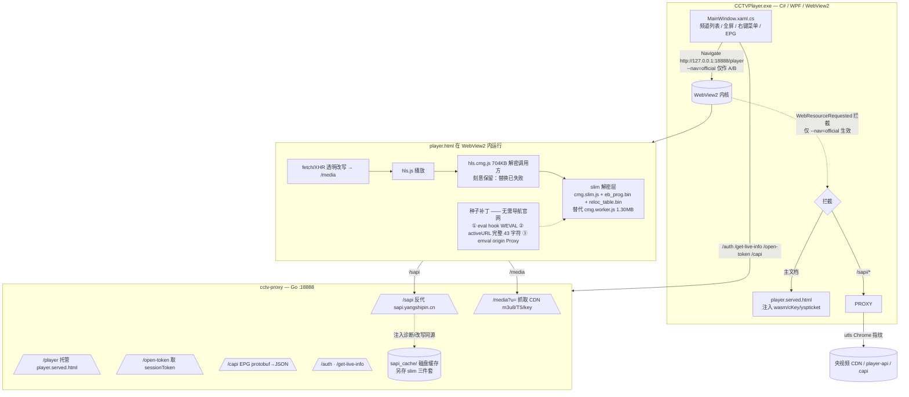

# CCTV / 央视频 桌面 + 鸿蒙播放器（CCTVPlayer / CctvPoC）

> 央视频（yangshipin.cn）直播客户端，**双端**：桌面（**C# / WPF / WebView2 + Go 反向代理**）+ 鸿蒙（**ArkTS / ArkWeb，`CctvPoC/`**）。
> 目标：在自有应用中实现央视频直播的**纯净、长期、无间断播放**——**不打开官网页面**，无黑屏、无花屏、无周期重载。
>
> 项目核心攻克了「请求参数破解 → 网络层绕过 → 视频解密攻破 → 长期播放衰减自愈 → 源文件瘦身 → 鸿蒙落地」的端到端闭环，是一份完整的逆向工程实战样本。

⚠️ **合规声明**：本项目仅供 **技术研究 / 学习逆向工程原理** 使用。使用者须遵守所在地区法律法规与央视频平台服务条款，不得用于任何侵权传播、商业转售或绕过付费墙的行为。仓库代码不包含任何受版权保护的媒体内容，仅含自行逆向得出的接口与算法逻辑。

> 📌 **先读**：完整逆向记录见 [`央视频定制APP技术白皮书.md`](./央视频定制APP技术白皮书.md)（**V6.0**，强烈建议先读，内含每场"战役"的死路与弯路）。
>
> ⚠️ **V6.0 是"推翻式"修订（2026-09）**：本 README 旧版写成事实的几条结论已被**证伪**——最关键的是：**根本不需要真实导航央视频官网**。详见白皮书「§〇 被推翻的旧结论」总表。

📦 **素材与构建说明**：本公开仓库**只含自研代码**。官方网页资源、解密引擎素材与逆向工具链（`源文件/`、`cctv-proxy/sapi_cache/`、`rev/` 及部分 wasm/js 注入素材）**不随公开仓库分发**（保留于私有备份）。`CCTVPlayer.csproj` 对这些文件均为"存在即引用"，新克隆缺素材时仍可正常编译；**发布包（GitHub Release 附件）是完整可运行版本**，直接下载即可使用。

---

## 一、功能特性

| 类别 | 状态 | 说明 |
|------|------|------|
| 央视 / 卫视直播 | ✅ | 内置 40+ 频道（CCTV-1~17、4K、各大卫视） |
| 纯净播放 | ✅ | VMPATCH3 wasm 内存热修补，30s 衰减 0 帧、黑屏 0 次 |
| **不导航官网** | ✅ | 本地 `127.0.0.1` + `eval` hook（WEVAL）+ `activeURL` 种子 + emval `origin` Proxy。**推翻旧"必须真实导航 yangshipin.cn"结论** |
| **源文件瘦身（slim）** | ✅ | `cmg.worker.js` 1.30MB → `cmg.slim.js` 186KB + `eb_prog.bin` 378KB + `reloc_table.bin` 40KB ≈ **604KB**（−54%）。`hls.cmg.js`（704KB）**刻意保留**——替换它的尝试已失败（见 4.4） |
| **鸿蒙端（`CctvPoC/`）** | ✅ 已交付 | ArkWeb + slim，真机换台正常。**媒体卡台标已解决（2026-09-03 真机验证通过）**：原生手动 `createAVSession` + `setAVMetadata(mediaImage: PixelMap)`；音频全程 share/MIX，与酷狗等并存不打断 |
| 节目单 EPG | ✅ | 状态栏滚动显示「正在 / 即将」，右键菜单完整节目表 |
| hls.js 致命错误自愈 | ✅ | 解码崩溃自动重载并恢复拉流 |
| 时移 / 直播内拖动 | ❌ 未完成 | **解密不是瓶颈**——单纯没实现（见 8.1） |
| 节目回看 / 点播 | ❌ 未完成（逆向失败已还原） | **VOD 解密路径确实存在**（`_CMG_jsdecVOD0..8`）——唯一瓶颈是拿不到移动端回看接口（见 8.2） |
| 本地录制 | ❌ 未完成 | — |
| 多清晰度切换 | ⚠️ 部分 | 当前固定 `fhd`，接口已支持 4K / 8K（见已知问题） |

---

## 二、整体架构


```mermaid
flowchart TB
    subgraph CSharp[CCTVPlayer.exe — C# / WPF / WebView2]
        UI[MainWindow.xaml.cs<br/>频道列表 / 全屏 / 右键菜单 / EPG]
        WV[(WebView2 内核)]
        UI -->|Navigate http://127.0.0.1:18888/player<br/>--nav=official 仅作 A/B| WV
        WV -. WebResourceRequested 拦截<br/>仅 --nav=official 生效 .-> INT{拦截}
        INT -->|主文档| LOCAL[player.served.html<br/>注入 wasm/cKey/yspticket]
        INT -->|/sapi/*| PROXY
    end

    subgraph Go[cctv-proxy — Go :18888]
        P1[/ /sapi 反代 sapi.yangshipin.cn\]
        P2[/ /media?u= 抓取 CDN m3u8/TS/key\]
        P3[/ /player 托管 player.served.html\]
        P4[/ /open-token 取 sessionToken\]
        P5[/ /capi EPG protobuf→JSON\]
        P6[/ /auth · /get-live-info\]
        CACHE[(sapi_cache/ 磁盘缓存<br/>另存 slim 三件套)]
        P1 -. 注入诊断/改写同源 .-> CACHE
    end

    subgraph Web[player.html 在 WebView2 内运行]
        NET[fetch/XHR 透明改写 → /media]
        HLS[hls.js 播放]
        CMG[hls.cmg.js 704KB 解密调用方<br/>刻意保留：替换已失败]
        SLIM[slim 解密层<br/>cmg.slim.js + eb_prog.bin + reloc_table.bin<br/>替代 cmg.worker.js 1.30MB]
        SEED[种子补丁 —— 无需导航官网<br/>① eval hook WEVAL ② activeURL 完整 43 字符 ③ emval origin Proxy]
        NET --> HLS --> CMG --> SLIM
        SEED -.-> SLIM
    end

    WV --> Web
    PROXY -->|utls Chrome 指纹| CDN[(央视频 CDN / player-api / capi)]
    Web -->|/media| P2
    Web -->|/sapi| P1
    UI -->|/auth /get-live-info /open-token /capi| Go
```

**要点（2026-09 更新）**：页面跑在**本地 `127.0.0.1:18888/player`**。CMG 解密种子不再来自真实 `location`，而是由**三个补丁**提供：

1. **`eval` hook（WEVAL）**——wasm 读 `location` 的**唯一出口**是 `eval()`（`_emscripten_asm_const_ii`，全模块仅 1 处），而 `eval` 是普通全局函数，可直接 hook。
2. **`self.activeURL` 预置**——真正进入 wasm 的种子；`moduleDecData` 每次把它的 charCodes 追加到 NALU 之后（长度 `jL` 单独传参）。必须是**完整 43 字符、含域名**，且属性须 `writable:true`。
3. **emval `origin` Proxy**——官方 INITPLAYER 分支**第一个取值就是 `self.origin`**（路径 `__emval_get_global('origin') → globalThis.origin`）。它**不走 eval**，只有 `/location/` 正则的 hook 会漏拦。症状：**只坏 P/B 帧（t=1）、IDR（t=5）正常**。

`WebResourceRequested` + 真实导航官网**仅保留**作 A/B 对照与回退路径（`--nav=official`），**不再是必需**。媒体仍全部经 Go 代理转发，以规避 CORS / CDN TLS 指纹。

**等价性证据**：三个补丁齐后，本地播放与导航官网**逐帧等价**（前 1200 帧 `same=Y` 都是 **1**；修复前本地是 1206N / **1194Y**，修复后 6013N / 9Y）。

---

## 三、目录结构

```
d:/TV/CCTV/
├─ cctv-proxy/                # Go 反向代理 + 注入
│  ├─ main.go                 # 代理路由 + hls.cmg.js 注入
│  ├─ build.ps1               # 校验注入语法 → go build → 覆盖 bin
│  ├─ verify_inject.cjs       # 注入串 JS 语法校验
│  └─ sapi_cache/             # 上游脚本磁盘缓存（随发布包分发）
│                             #   另存页面用的 slim 三件套：
│                             #   cmg.slim.js / eb_prog.bin / reloc_table.bin
├─ CCTVPlayer/                # C# WPF 客户端（桌面）
│  ├─ MainWindow.xaml(.cs)    # 主窗口 / 本地导航 / 拦截(A/B) / 滚动 EPG
│  ├─ CctvApi.cs              # CctvApiClient：签名算法 + 频道表 + kvcollect
│  ├─ WasmSigner.cs           # 备用：Wasmtime 加载 keygen_bg.wasm 算 sig2
│  ├─ player.html             # 播放页：网络拦截 + cKey/yspticket 注入 + 三大种子补丁
│  ├─ keygen_bg.wasm          # 签名 wasm（get_signature / get_token_rnd）
│  ├─ RJq7sO71JF.wasm         # yspticket wasm（AES-CTR + PCG）
│  ├─ ts_module_body.js       # cKey 生成内核（官方 chunk-vendors 模块）
│  └─ CCTVPlayer.csproj       # 单文件自包含发布（win-x64）
├─ CctvPoC/                   # ★ 鸿蒙客户端（ArkTS / ArkWeb）
│  ├─ entry/src/main/ets/pages/Index.ets      # ← 改 player.html 必须 PLAYER_DEPLOY_VER +1
│  ├─ entry/src/main/ets/.../ArktsProxy.ets   # 纯 ArkTS 本地代理 :18888（手机不支持 native 子进程）
│  └─ entry/src/main/resources/rawfile/web/player.html
├─ rev/                       # ★ 离线逆向实验室（Node）
│  ├─ gen_slim.cjs            # 生成 cmg.slim.js（eval/emval 补丁 + eb_prog 外置）
│  ├─ gen_hm_inline.cjs       # 把 slim+资产内联进鸿蒙 player.html
│  └─ dist/                   # cmg.slim.js / eb_prog.bin / reloc_table.bin / cmgdec.js
├─ backup_*（本地备份，不入库）    # 台标可用方案参考实现见 §9.3（本地 backup_CctvPoC_20260830_clean/）
├─ 央视频官方源文件/           # 抓包原始脚本（hls.cmg.js 等，参考用）
├─ cmg.wat / cmg_decrypt.wasm # 解密 wasm 反编译（逆向分析用）
├─ cmg_c.c / wasm-rt.h        # ★ wasm2c 原生解密移植（方案 B 核心，见九.4）
└─ 央视频定制APP技术白皮书.md  # 完整逆向记录（强烈建议先读）
```

---

## 四、参数与算法生成（核心原理）

播放一次直播需构造一连串**带签名的请求**与**动态密钥**。全部算法已逆向并落地，分为三套体系：

### 4.1 请求链路
```
/auth ──authToken──┐
                   ├─► /web/open/token ──sessionToken──┐
/get_live_info ────┴──────── sig2(用 sessionToken) ───┴─► m3u8 URL
```
- `authToken`（`/auth` 返回）：仅作网关层 `yspplayertoken` 头。
- `sessionToken`（`/web/open/token` 返回）：是计算 `sig2` 的真正密钥。**两者互不相通，混用会 20401**。

### 4.2 签名算法一览

| 签名 | 算法 | 排序 | 盐 | 位置 |
|------|------|------|----|------|
| `auth` body 签名 | 盐化 MD5 | Ordinal | `n@7QKk%YeSjfw%22` | `CctvApi.ComputeAuthSignature` |
| `live` body 签名 | 盐化 MD5 | Ordinal | `0f$IVHi9Qno?G` | `ComputeLiveBodySignature` |
| `yspsdkinput`(rnd) | 无盐 MD5 | **localeCompare** | 无 | `ComputeLiveSdkInput` |
| `sig2`(yspsdksign) | `keygen_bg.wasm` `get_signature` | — | — | `player.html` `__generateSignature` / `WasmSigner` |
| `kvcollect` 心跳 | 盐化 MD5 | Ordinal | `n@7QKk%YeSjfw%22` | `ComputeKvCollectSignature` |

> ⚠️ **排序陷阱**：`su`/`au`(body) 用 JS 默认 `Array.sort()`(Ordinal)；`xs`/`ne`(`yspsdkinput`) 用 `String.localeCompare`。混用即签名错 → 401。

### 4.3 动态密钥（均在 WebView2 内生成，零官网依赖）
- **`cKey`**（324 字符）：纯 JS（`ts_module_body.js`，复刻官方 webpack 模块 `fb15` 的 `ts()`），用 env-stub 提供 `document.URL` 等 DOM 输入。`tsSec` 须**每次实时秒级时间戳**，否则过期 401。
- **`yspticket`**（62 字节）：复刻官方 `_c(livepid, ts, cnlid, guid, yspappid, appVer)` + `RJq7sO71JF.wasm`（AES-CTR + PCG 尾缀）。`ts` 取自 `/auth` 响应的 `data.ts`。
- **`sessionToken`**：先 `get_token_rnd()` 取 rnd，再 `GET /web/open/token`（带 `vappid=59306155`/`vsecret=…`）。

### 4.4 视频解密（CMG wasm 逐 NALU 解密）

- **解密调用点**：`hls.cmg.js` 的 `fG[wz(0x6bf)](module, ts, nalu, key)`，仅对 **IDR(5)/P/B(1)** 解密。**必须逐 NALU**——每次调用都是完整独立的往返（URL+key 每次重传），漏一个即花屏。SPS/PPS/SEI/AUD 本就明文，当前已是最小集，**无进一步优化空间**。
- **密钥种子（★ 2026-09 更正）**：旧版说 wasm 用 `self.location.href`（C++ 绑定）作种子、因此必须真实导航官网——**是错的**。真实路径就是上文"要点"里的三个补丁。**真实导航不是必需的**。
- **长期衰减（30s 花屏）**：wasm 是 VMProtect 式字节码 VM（`func[51]`/`func[71]` 用 `br_table` 分发），内部 **~750 帧计数器**（**反篡改自检**，非许可证）随后选择性返回恒等。**终极方案 VMPATCH3**：InitPlayer 完成后（T+6s）snapshot wasm 线性内存非零块，每 2s 对比并原地写回所有变化字节 → 计数器永不到阈值 → 纯净无间断。
  - ⚠️ 扫描范围 `6684672~6698000` **硬编码绑定了这个 wasm 构建**（`V=1.2.1`、`CMG_BTime=Aug 13 2025`）。上游更新 wasm 后必须重新确认（白皮书 §15.2）。
- **★ 解密路径现状（2026-09 更正）**：wasm **同时导出 Live 与 VOD 路径**——`_CMG_jsdecLive0..8` **和 `_CMG_jsdecVOD0..8`**（`na..va = func[73..105]`），另有 `StaticCallModuleVod`（10 方法）与 `StaticCallModuleVodMap=[0..6]`；`moduleDecData` 第 4 参本就是 `'live' | 'vod'`。⇒ **回看/点播的解密不是瓶颈**，旧版"没有 VOD 解密导出"是看漏了导出表。
- **槽位映射（Proxy 实测）**：索引 8=`MpegAudio`→`_CMG_jsdecLive8`/`_CMG_jsdecVOD8`；7=H264NalSet；6=H265NalData；5=AVS1AudioKey；4=HEVC2AAC；3=HASHMap；2=BASE64Dec；1=MediaSession；0=Mp4fragment。
- **调用签名（已实证）**：`_CMG_jsdecLive8(tagIdPtr, naluPtr, naluLen, urlLen)` —— **4 参**，返回输入长度、**原地写回**。内存布局 `[nalu][activeURL charCodes][mediaTagId charCodes]`。
- ⚠️ `jsdecLive8` 是**状态机变换，不是 XOR**（对已解密数据二次调用仍会变）。⇒ **`diff>0` 不等于解对了**——唯一有效的判据是与官方输出**逐字节比对**。

---

## 五、EPG 节目单

- 数据源：`GET https://capi.yangshipin.cn/api/yspepg/program/{pid}/{yyyyMMdd}`，返回 **protobuf**（`[1]total [2]programs`，节目 `[1]id [2]title [5]start [6]end [7]duration`）。
- Go 代理 `/capi/*` 把 protobuf 解码为 JSON 数组 `[{id,title,start,end},...]`。
- C# 每 30s 刷新，状态栏双滚动行显示「正在 / 即将」，右键菜单「节目单 ▸」子菜单展示全天列表（当前节目红色加粗）。

---

## 六、构建与运行

### 依赖
- **.NET 10 SDK**（目标 `net10.0-windows`，自包含单文件）
- **Go 1.2x**（仅改代理时需要）
- **Node.js**（仅 `build.ps1` 校验注入串时需要）
- **WebView2 Runtime**（用户机需安装）

### 开发调试
```powershell
# 改 cctv-proxy/main.go 注入串后（强制）：
cd d:/TV/CCTV/cctv-proxy; .\build.ps1
# 改 C# 后：
cd d:/TV/CCTV/CCTVPlayer; dotnet build -c Debug
```
> `build.ps1` 会先用 `verify_inject.cjs`（`vm.Script` 校验整文件语法）再 `go build`，**绝不要裸 `go build`**——注入串语法错误会让整段 `hls.cmg.js` 解析失败，表现为「Hls 不支持」。
> 📌 改 `player.html` 后 `dotnet build` 增量**不会复制**它（`PreserveNewest` 按时间戳），须手动 `Copy-Item player.html bin/Debug/net10.0-windows/win-x64/ -Force`。

### 打包分发（Release）
```powershell
cd d:/TV/CCTV/CCTVPlayer; dotnet publish -c Release
```
**发布包必须随附**：
- `cctv-proxy.exe`（csproj 已自动复制）
- `sapi_cache/`（含 slim 三件套，已配置 `CopyToPublishDirectory`）
- `player.html` / `keygen_bg.wasm` / `RJq7sO71JF.wasm` / `ts_module_body.js`（已配置）
- `seqid.state` 可不存在（首次运行自动生成）

> 📌 **已知发布坑**：Release 单文件发布会把 exe 解压到 temp 目录，而 `cctv-proxy.exe` 在 `AppContext.BaseDirectory` 下找 `sapi_cache`。确认发布目录里 `sapi_cache/` 与 `cctv-proxy.exe` 同级；EPG 依赖 Go 代理 `/capi` 正常运行，代理未启动则节目单为空。

### 鸿蒙端构建
- 用 DevEco Studio 打开 `CctvPoC/`。**改 `rawfile/web/player.html` 后必须把 `entry/src/main/ets/pages/Index.ets` 里的 `PLAYER_DEPLOY_VER` +1**，否则部署缓存命中、改动不生效。判据：日志 `[runInit] player_boot.html 已读取` 后标 `(首次部署)` = 真重新部署；标 `(缓存命中)` = 用了旧内容。
- 生成 slim/内联：`node rev/gen_slim.cjs && node rev/gen_hm_inline.cjs`。

---

## 七、诊断与排错

| 现象 | 根因 | 处理 |
|------|------|------|
| `401` | 算法错 / 时效值过期 | cKey/yspticket/token 须实时生成 |
| `20401` | `sig2` 用了 authToken | 改用 sessionToken |
| `networkError` | CORS / TLS 指纹 | 媒体全走 `/media` |
| 全帧花屏 | **三大种子补丁之一没对齐**。最常见：`activeURL` 用了 `replace('yangshipin.cn','')` 后的 30 字符短串；或 `defineProperty` 缺 `writable:true`（那条 `Cannot assign to read only property 'activeURL'` 是**我们自己的 bug**，不是 WebView2 限制） | 预置**完整 43 字符含域名** + `writable:true`；见 4.4 / 白皮书 §10 |
| **只坏 P/B 帧（t=1）、IDR（t=5）正常** | `self.origin` 经 emval 泄露（`__emval_get_global('origin')`），**不走 eval**，只拦 `/location/` 的 hook 会漏 | 加 emval `origin` Proxy |
| 30s 后马赛克 | wasm ~750 帧反篡改计数器 | VMPATCH3（已解决）。上游更新 wasm 后重查扫描范围 |
| `[JS] Hls不支持` | 注入串 JS 语法错 | `node --check` / `build.ps1` |
| 鸿蒙：切台黑屏 + `memory access out of bounds` | `__SLIM_WRITE_EB__` 闭包捕获了**第一个**实例的 `HEAPU8`/`eb`，第二实例把 eb_prog 写进前一个实例的堆 | slim 改为参数传堆 + 删 `__SLIM_DONE__`（白皮书 §11.4） |
| 鸿蒙：媒体卡片**没有台标** | Web 侧 `navigator.mediaSession.metadata` **从未生效**——日志 `artwork 已设置` 正常但系统媒体卡无台标 ⇒ **ArkWeb 不把 MediaSession artwork 桥接到系统 AVSession** | **唯一可用 = 原生手动 `createAVSession` + `setAVMetadata({mediaImage: PixelMap})`**（必须 catch `6600101`；见 §九.3） |
| 鸿蒙：手动 `createAVSession` 后媒体卡片消失 | **不是**"手动 create 冲突"。真因是把 **`6600101`（Session 已存在）当致命错误**处理 | 按 §九.3 实现：catch `6600101` 跳过 + 先注册监听再 `activate()` + 退出 `deactivate()`/`destroy()` |

日志位置（桌面 `bin/.../win-x64/`）：`cctv-debug.log`（WebView2 postMessage）、`cctv-proxy.log`（Go stdout）。鸿蒙看 hilog。

---

## 八、未完成任务（欢迎认领 🚀）

### 8.1 时移 / 直播内拖动（Timeshift）
- **目标**：直播中可暂停后向后拖动，或在 HLS 滑动窗口内回退到某节目起点播放（类 DVR）。
- **现状**：`IsCurrent`（当前节目高亮）已实现；**seek / 回退播放没有实现**（代码中无任何 seek 相关实现）。HLS 直播本身存在滑动窗口，技术上可行，缺的是交互层与接通。
- **澄清**：**解密不是这里的瓶颈**——单纯没实现 UI + 管道。
- **思路**：
  1. 在 `player.html` 暴露 `seekToProgram(offsetSec)` → `v.currentTime = hls.liveSyncPosition - offsetSec`。
  2. 复用 EPG 的节目起止时间计算 offset。
  3. 注意 CMG 解密是**有状态**的，拖动超出 wasm 密钥窗口可能需重新 InitPlayer。

### 8.2 ★ 节目回看 / 点播（Catch-up VOD）—— 逆向失败，已还原

> **本项是本项目最大的未解难题，也是唯一一次明确"逆向失败并还原"的尝试。特单列失败总结，提醒后来者不要重复踩坑。**

#### 失败总结（Why it failed / dead end）

| 项 | 内容 |
|----|------|
| 失败时间 | 2026-07（具体 PR 已还原，代码库不含任何回看尝试） |
| 根本原因 | 本项目逆向对象是央视频 **网页版**（`yangshipin.cn`），而**网页版根本没有"回看"功能**——回看（往期节目点播）只在**移动端 App** 提供。**这是唯一的真瓶颈。** |
| 尝试路线 | 转向移动端：用**多个 Android 模拟器**拦截 App 的网络请求，企图抓到官方原始回放（catch-up）请求。 |
| 失败点 | 模拟器内 **TLS 握手始终不成功**，无法建立到央视频服务器的加密连接，因此**始终拿不到任何一条官方回放请求**，也就无从逆向回放的 playurl 接口与签名参数。 |
| 结局 | 因无法突破"拿到回放请求"这一前提，整条回看链路无法推进，相关实验代码已**全部还原**，仓库当前不含回看相关代码。 |

#### 为什么这比直播更难

1. **接口不在网页版**：直播参数体系（authToken/sessionToken/sig2/cKey/yspticket）全部来自网页版，而回看接口位于移动端私有 API，参数体系可能完全不同（不同 salt、不同签名、可能含设备指纹 / token）。
2. ~~**解密层缺入口**~~ → **★ 2026-09 更正：这条是错的。** wasm **确实导出 `_CMG_jsdecVOD0..8`**（`na..va = func[73..105]`），`StaticCallModuleVod` 10 个方法、`StaticCallModuleVodMap=[0..6]`；`moduleDecData` 第 4 参本就是 `'live' | 'vod'`。**解密不是瓶颈**（见 4.4），别再去找什么"独立的 VOD 解密 wasm"。
3. **TLS / 证书固定**：移动端 App 普遍做证书固定（certificate pinning），模拟器里即使能抓包也会被 TLS 校验拦下，这正是本次失败的直接技术原因。

#### 后续可能可行的方向（供认领，须先解决前提）

1. **真机抓包**：root / 越狱真机 + Charles/Fiddler + 证书固定绕过（如 Frida hook `checkServerTrusted`），抓出真实回放请求。**这是所有后续的唯一前置条件。**
2. **寻找网页版隐藏入口**：部分节目在 `capi` 可能带 `vid`，可试探是否存在网页版也能用的点播端点——**成本最低，值得先试**。
3. ~~**VOD 解密 wasm**~~ —— **大概率不需要**，现有 wasm 已含 VOD 路径；除非与官方输出逐字节比对失败才重新考虑。
4. **先落地 8.1 直播内回看**：作为过渡，先实现 HLS 滑动窗口内的拖动，至少能"看刚才播过的那段"。

### 8.3 本地录制
- 边播边把 TS / 解密后帧存为 mp4（需处理 CMG 解密后数据的本地封装）。

### 8.4 多清晰度 / 8K 稳定
- `defn` 已支持 `fhd/shd/4k/8k`。**已知风险**：8K 高码率下 VMPATCH3 的「diff>2KB 块跳过」保护可能误跳过 wasm worker 活跃块 → 与 worker 竞争 → 缓冲错误。需优化 8K 下的内存热修补策略。

### 8.5 频道表自动化
- 当前 `CctvApi.Channels` 硬编码 pid/cnlId。**卫视 pid 可能随官网上线变动**。可加：从官网接口自动拉取频道列表 + pid/cnlId 校验 / 自愈。

### 8.6 跨平台
- 桌面当前仅 `win-x64`（WebView2 是 Windows 专属）。Linux/macOS 需替换为 CEF / WebKit2 / 自研浏览器内核。
- **鸿蒙端已交付**（`CctvPoC/`，见 §九）。好消息：方案 A 的**内核无关性已被 ArkWeb 移植验证**，将来做 CEF 移植风险可控。

### 8.7 工程化增强（很值得做，易上手）
- 🔧 **VMPATCH3 自适应**：扫描范围 `6684672~6698000` 目前硬编码绑定了 wasm 构建（`V=1.2.1`）。改为**自动探测非零 4KB 块**并对 wasm 版本做断言——上游更新时**直接报错**而不是静默花屏。
- 🔧 **`sapi_cache` 自动失效并重跑 `verify_inject.cjs`**：上游 CMG 脚本更新时，当前靠手动删缓存重抓。自动比对版本头/长度，变化则重抓**并重新校验注入串**（否则会表现为误导性的「Hls 不支持」）。
- 🔧 **`eb_prog.bin` / `reloc_table.bin` gzip 传输**：378KB→140,645B / 40KB→4,799B。保持独立文件传输，**不要**解压后内联（`ATPRERUN` 是同步的）。
- 🔧 **签名算法单元测试**：已有 HAR 黄金值，可加 CI 自动校验，防止盐 / 排序回归。
- 🔧 **设置面板**：代理端口、默认清晰度、缓冲时长、EPG 刷新间隔、kvcollect 开关。
- 🔧 **代理进程守护**：`cctv-proxy` 崩溃时自动重启。
- 🔧 **EPG 多日 / 未来预告**：当前仅当天；可扩展 `yyyyMMdd` 参数拉取未来几天。
- 🔧 **字幕 / 多音轨**：部分频道有，当前未接入。
- 🔧 **播放进度 / 音量持久化 / 频道图标 / 主题切换 / 录制 + 定时录制**。

---

## 九、鸿蒙端移植（CctvPoC）

同一套解密链路跑在鸿蒙 **ArkWeb** 里（与 WebView2 同内核家族），逆向成果几乎原样复用。

### 9.1 与桌面的差异

| 桌面 | 鸿蒙 | 原因 |
|---|---|---|
| Go 子进程（`cctv-proxy.exe`） | **ArktsProxy**——纯 ArkTS 本地 HTTP 服务 `127.0.0.1:18888` | 手机**不支持启动 native 子进程**（错误 801） |
| `cmg.worker.js` 1.30MB | **slim**：186KB + 378KB + 40KB ≈ 604KB | 原文件 85% 是十进制数组字面量；见 4.4 |
| `dotnet build` 复制 `player.html` | 改 `player.html` 必须 **`PLAYER_DEPLOY_VER` +1** | 部署注入生成 `player_boot.html` 并缓存，版本号不变改动不生效 |

### 9.2 ⚠️ `enableNativeMediaPlayer` 与本项目解密架构**不兼容**

- 我们的解密产物只在 JS 内产生明文，**只能经 MSE `sourceBuffer.appendBuffer()`** 送进解码器——因此 `video.src` 是 `blob:`/MediaSource（**没有真实 URL**）。
- `enableNativeMediaPlayer` 把 `<video>` 的 `src`/`mediaInfo` 交给原生 AVPlayer 自己拉流——**MSE 数据根本不经过 `src`**。
- ⇒ 接管后 AVPlayer 播的是**原始未解密 HLS** → 花屏/绿屏。（与"标准 hls.js + 自写 cmgdec 桥"那次失败同根：只有**不加密**的 CCTV-6 能播。）

**二选一**：要解密 ⇒ 必须 MSE ⇒ 不能接管 ⇒ 拿不到原生解码性能；要接管 ⇒ 只能播不加密频道。**在"Web 侧解密 + 原生解码"这个切分点上，数据跨不过去。**

### 9.3 ★ 媒体卡片台标（AVSession）—— 2026-09-03 用户实测的最终结论

> ⚠️ 此前文档写过"**绝不手动 createAVSession**、用 `navigator.mediaSession.metadata`"——**这条已被用户实测推翻**。

**结论一句话：台标的唯一可用方案 = 原生手动 `createAVSession` + `setAVMetadata({ mediaImage: PixelMap })`。**

- **Web 侧 `navigator.mediaSession.metadata` 从未生效**：真机日志能看到 `artwork 已设置 144x72`（Web 侧代码本身正确），但系统媒体卡**始终没有台标**。⇒ **ArkWeb 不把 MediaSession artwork 桥接到系统 AVSession**。再调推送时机/尺寸/格式都没用。
- **手动 createAVSession 完美解决台标** —— ✅ **2026-09-03 真机验证通过**：`[avsession] 媒体元数据已更新: CCTV-1/CCTV-2` 切台同步，媒体卡台标正常；与酷狗并存时全程 `mode=MIX (share策略)` 互不打断。可用备份：`backup_CctvPoC_20260830_clean/`。

**关键实现要点（缺一不可）：**
1. `avSession.createAVSession(ctx, 'CCTVPlayer', 'video')`；
2. **必须 catch `6600101`（Session 已存在）并跳过**——ArkWeb 可能已先创建，**这不是致命错误**。⚠️ 早年"媒体卡片消失"的真因就是把 `6600101` 当致命错误处理，**不是**手动 create 本身冲突；
3. **先注册 `play`/`pause` 监听，再 `activate()`**；
4. 初始 `setAVPlaybackState(PAUSE)`（避免无音频流时系统拒绝显示），真正播放时改 `PLAY`；
5. 台标：`setAVMetadata({ assetId, title, artist, mediaImage: pixelMap, duration: 0 })`，`pixelMap` 由 base64 dataURL 经 `image.createImageSource` 解码；
6. 退出时 `deactivate()` + `destroy()`；
7. `initAVSession()` 与代理/页面启动**并行**执行（冷启动优化）。

**台标图真实尺寸**：CCTV 系 **144×72**、卫视系 **144×100**。

### 9.4 ★ `AVSession` ≠ `AudioSession`（"音频独占"担心的根源）

| | **AVSession**（AVSessionKit） | **AudioSession**（AudioKit `AudioSessionManager`） |
|---|---|---|
| 作用 | 媒体会话：播控中心 / 媒体卡片的**展示**（标题、台标、播放/暂停） | 音频会话：决定**音频并发策略**（是否打断其他应用声音） |
| 参与音频焦点？ | **完全不参与** | **是**（`MIX_WITH_OTHERS` / `PAUSE_OTHERS`） |
| 手动创建的影响 | 只影响"有没有媒体卡 / 台标" | 只影响"混音还是独占" |

⇒ **手动 `createAVSession` 对"音频独占"零影响**。要台标 → 手动 createAVSession；要音频合规 → 只调 AudioSession 并发模式。两者完全独立。

**音频合规现状（两版代码均已 `audioExclusive:false`）**：
- 当前（已回退）代码：`AudioSessionManager` **恒定** `CONCURRENCY_MIX_WITH_OTHERS`（最保守）。
- **台标可用备份（08-30）**：**动态**策略——静音(`muted`) → `MIX`（不打断其他）；解除静音 → `PAUSE_OTHERS`（暂停其他）；退出即 `deactivateAudioSession()` 释放焦点。
- **上架风险评估**：`PAUSE_OTHERS` 只在**有声播放**时生效，是视频 App 的**标准预期行为**（YouTube / 央视频同样如此），静音时主动让出、退出即释放，合规充分。**若想绝对保守**：只恢复 AVSession 部分、AudioSession 保留恒定 `MIX` 即可 → 台标解决 + 音频行为完全不变 + 上架风险最低。

### 9.5 方案 B（wasm2c 原生解密 / AVPlayer）现状

- **解密已证实可脱离浏览器正确工作**：`cmg_c.c`（wasm2c）输出与官方 Node 实现**逐字节一致，6/6 帧**。此前"方案 B 死刑"是 **harness bug 造成的假阴性**（`emval_as` 对 `std::string` 返回 emval 句柄而非 wire 指针，域名校验失败走了 decoy 分支）。
- **但整体仍冻结**——剩余瓶颈全在 **AVPlayer 集成侧**，与解密无关：demux 不可插桩（TS→PES→NALU→解密→重喂得全自研）、解密输出**非定长**（`32198→32197`）须改写 NALU 长度、`InitPlayer` 是深度递归字节码 VM。
- **可行骨架（若重启）**：鸿蒙 **API 20（鸿蒙 6.0）+** 的 `OH_AVDataSource`，用 `readAt` 回调把**已解密**内存数据喂给 `AVDemuxer → AVCodec`。因为数据源在你手里，"AVPlayer 黑盒不可插桩"就此破解。剩余成本收敛为「TS 解析/重封装 + 自研 mini-HLS 播放列表」。
- **版本漂移/脆弱性：两方案持平**——方案 A 同样要重抓 slim + 重跑 `verify_inject` + 重新上架，差异只在「改 C 重编译 vs 改注入串重打包」。**真正差异只有一条：demux/NALU 集成成本**（方案 A 由 hls.js 免费提供）。
- **结论**：方案 A（ArkWeb）已落地且三大动机（**台标 / 冷启动 / 音频**）在 A 内均可解 → **维持方案 A 为交付基线**。

---

## 十、如何参与贡献

1. 先读 `央视频定制APP技术白皮书.md`（逆向全过程与「死路」记录，避免重蹈覆辙）。
2. 环境搭建见「六、构建与运行」。
3. 调试时优先看 `cctv-debug.log` + `cctv-proxy.log`（桌面）/ hilog（鸿蒙），对照「七、诊断与排错」。
4. 提交 PR 前：
   - 改 `main.go` 注入串务必过 `build.ps1` 校验；
   - 签名算法改动用 HAR 黄金值自测；
   - 改鸿蒙 `player.html` 记得 `PLAYER_DEPLOY_VER` +1；
   - 在 PR 说明里标注「动的是哪套签名 / 哪个战役的逻辑」。
5. 认领「八、未完成任务」里的条目时，**回看（8.2）请先读完失败总结并在 Issue 同步思路**，避免重复踩 TLS 抓包的坑。

---

## 十一、致谢与参考
- 解密 wasm 反编译借助 `wabt`（`wat2wasm`/`wasm2wat`）。
- 签名算法验证依赖真实浏览器 HAR 抓包（golden value）。
- 感谢所有逆向工程社区的开源工具链。
